# GIG4U - Comprehensive Project Analysis

> **Document Version:** 1.0
> **Date:** February 24, 2026
> **Purpose:** Project clarity, UX journey mapping, and architectural reference

---

## Table of Contents

1. [Project Overview](#1-project-overview)
2. [Objectives](#2-objectives)
3. [Final Workflows](#3-final-workflows)
4. [User Experience Analysis](#4-user-experience-analysis)
5. [Journey Diagrams](#5-journey-diagrams)
6. [State Diagrams](#6-state-diagrams)
7. [References](#7-references)

---

## 1. Project Overview

### 1.1 What is GIG4U

**GIG4U is a Work Orchestration Platform for On-Demand, Distributed Human Tasks.**

GIG4U is not just a job board, gig app, or staffing tech. It is:

- A **task orchestration engine** that manages the full lifecycle of human work
- A **service quality enforcement layer** with measurement, evidence, and compliance
- A **human execution alternative** to APIs, automation, and agencies

The platform enables businesses to execute real-world work with the same control, visibility, and reliability as software — using verified humans instead of code.

### 1.2 Vision and Value Proposition

Everything in GIG4U revolves around **three core primitives**:

| Primitive | Definition | Examples |
|-----------|-----------|----------|
| **Work** | Any unit of human effort with a start condition, validation criteria, and a payout rule | Deliver a package, attend an event shift, verify a store audit, promote an app, collect survey data, run a kiosk |
| **Executor** (Human Runtime) | A verified human node with availability, skills, location, and trust score who executes Work under constraints | Service Providers who can be verified, tracked, timed, scored, paid, and ranked |
| **Orchestrator** | The party that wants work done but should not manage humans directly | Retail customer, enterprise, startup, or GIG4U itself (managed mode) |

**Core Value:** GIG4U replaces friction with configuration. It prices certainty, not effort.

| Problem | Traditional Approach | GIG4U |
|---------|---------------------|-------|
| Need human work | Hiring / agencies | On-demand execution |
| Need scale | Vendors | Platform orchestration |
| Need quality | Supervisors | Measurable validation |
| Need flexibility | Contracts | Configurable tasks |
| Need speed | Weeks | Minutes |

### 1.3 Three Operating Modes

GIG4U explicitly operates in three distinct modes, each with its own state machine:

#### Mode 1: Open Marketplace (Discovery Mode)

- **Who:** Retail customers, small businesses, individuals
- **How:** Post work, Executors apply, conversations happen, platform steps back
- **Monetization:** Job posting fee, applicant unlock fee, boosts/visibility
- **Guarantees:** Identity, Discovery, Access
- **Does NOT guarantee:** Outcome, Quality, Completion

#### Mode 2: Managed Execution (Service Mode)

- **Who:** Field services, multi-day tasks, event staffing, location-based work
- **How:** Customer describes outcome, GIG4U designs the task, Executors assigned, execution monitored
- **Key Features:** OTP-based start/stop, GPS validation, attendance timers, task checklists, form submissions, evidence capture
- **Monetization:** Fixed price, margin-based, SLA-driven
- **Guarantees:** Outcome, Quality, Replacement if failure

#### Mode 3: Enterprise Orchestration (Invisible Complexity)

- **Who:** Large brands, chains, platforms, corporates
- **How:** Customer never sees executors during sourcing — only job count, progress, completion, exceptions
- **Key Shift:** Enterprise customers don't want people. They want results.
- **Features:** Role-based access, attendance approval, bulk validation, offline pricing, custom invoicing, client-isolated data, identity masking during sourcing

### 1.4 Platform Surfaces

| Surface | Technology | Purpose |
|---------|-----------|---------|
| **SP App** (Mobile) | React Native (Expo) | Execution runtime for Service Providers — the "Human Operating System" |
| **Customer Portal** (Web/PWA) | Next.js 14 | Job posting, project management, approvals, monitoring, invoices |
| **Admin Control Plane** (Web) | Next.js 14 | Configuration studio — task types, evidence policies, attendance rules, payout logic, RBAC |
| **Partner Portal** (Web — v1.5) | Next.js 14 | Aggregator operations with scope-based access |

### 1.5 Customer Segments

| Segment | Flow Type | Configuration By | Operational Style |
|---------|-----------|------------------|-------------------|
| **Enterprise** | Managed by GIG4U | Backend team | Minimal input, backend populates project config, identity masking, modular features enabled by RBAC |
| **SMB** | Self-serve | Customer directly | Full project configuration, workforce selection, monitoring |
| **MSME** | Self-serve (guided) | Customer directly | Outcome-driven, managed execution option available |

### 1.6 Demand Hierarchy

The platform follows a strict demand hierarchy:

```
Customer Account
  -> Projects (demand + configuration flags)
      -> Sales Orders (task groups / execution instances)
          -> Tasks / Assignments / Slot Confirmations
              -> Validation / Attendance / Evidence
                  -> Rating -> Billing -> Payouts -> Margin
```

---

## 2. Objectives

### 2.1 Business Objectives

1. **Marketplace Creation** — Build a discovery platform where work meets verified human executors
2. **Managed Execution** — Provide outcome-guaranteed service delivery with full measurement
3. **Enterprise Orchestration** — Compete with outsourcing firms by offering API-level control over human tasks
4. **Measurement as Product** — Price certainty by measuring time, location, presence, output, evidence, and approvals
5. **Supply Quality Control** — Leaderboards, training, certificates, and behavioral scoring to build executor trust

### 2.2 Technical Objectives

| Objective | Description |
|-----------|-------------|
| **API-First** | All logic accessible via RESTful APIs; enterprise customers can integrate via API |
| **Multi-Tenant** | Customer Account = Tenant; all tenant-owned tables filtered by `tenant_id` |
| **RBAC-Driven** | Enforced at API layer, query layer, and UI visibility layer |
| **Audit Trails** | Immutable audit logs for every create/update/delete/override; ledger entries never modified |
| **Measurement-First** | Time, location, OTP (login + shift), evidence, approvals, GPS — all captured and validated |
| **Progressive Gating** | No hard blocks; browsing always allowed; restrictions apply only to apply/accept/attend/payout |

### 2.3 Technology Stack

> **Note:** The original PRD specified LAMP (PHP 8.2) + Flutter. The Tech Stack Proposal v2 recommends a different, modern stack. The v2 proposal is treated as the latest recommendation.

| Layer | Technology | Purpose |
|-------|-----------|---------|
| Main API | NestJS + TypeScript + Prisma | Business logic, RBAC, data access |
| Database | PostgreSQL | Single relational DB for all data, ACID transactions, row-level locking |
| Background Jobs | BullMQ on Redis | Payouts, reminders, expiry checks, invoice generation |
| Real-Time | WebSocket + Socket.io | Live attendance timer, chat, slot availability updates |
| AI Brain | FastAPI (Python) | Behavioral scoring, matching, reliability prediction |
| File Storage | AWS S3 | Evidence photos, videos, documents, certificates |
| Cache | Redis | Fast data access, session management |
| Payments | Razorpay SDK | Payouts to SPs, customer invoicing |
| SP Mobile App | React Native (Expo) | Android + iOS from single codebase |
| Web Portal | Next.js 14 | Customer portal + Admin control plane |

### 2.4 MVP Scope and Timeline

- **Go-Live Target:** April 17, 2026 (60-day build)
- **Approach:** Focused MVP with controlled scope, clean-slate rollout (no legacy migration)
- **Phase 1:** Identity, Tenant, Control Plane skeleton, SP onboarding, Marketplace
- **Phase 2:** Managed execution, Evidence, Attendance, Billing
- **Phase 3:** Enterprise orchestration, masking, OTP shifts, invoicing
- **Phase 4:** Partner portal, advanced pricing, SLA dashboards

---

## 3. Final Workflows

### 3.1 Overall Platform Workflow

This diagram shows the end-to-end platform flow covering authentication, SP side, client side, and the platform intelligence engine.

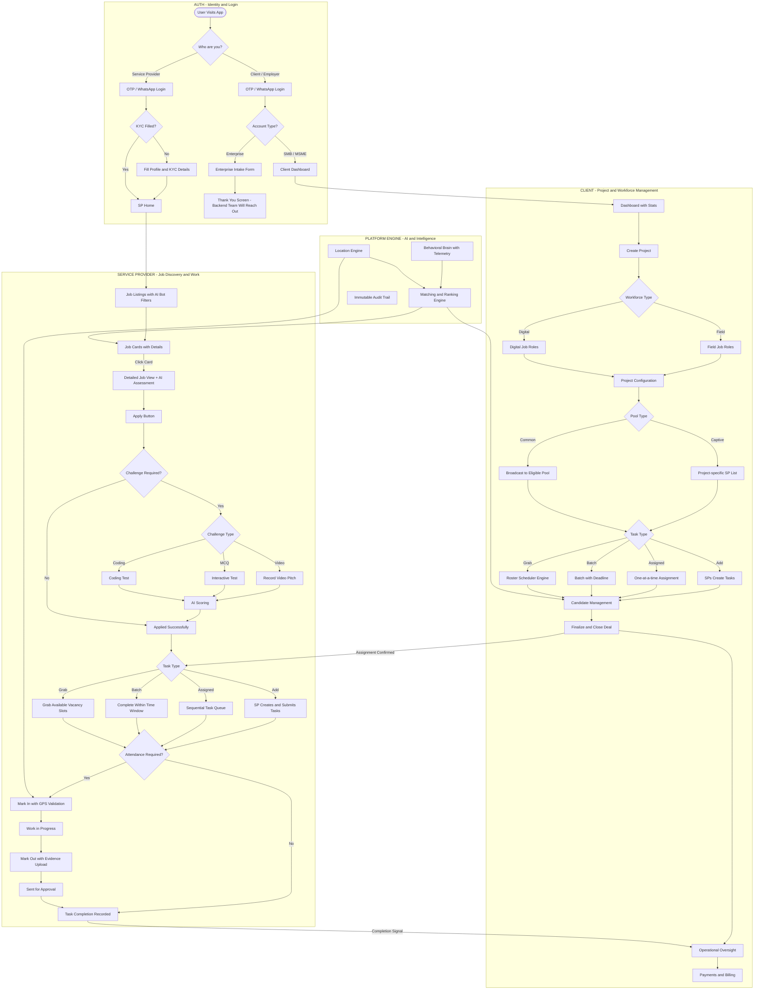
```mermaid
flowchart TB
    subgraph AUTH["AUTH - Identity and Login"]
        direction TB
        START([User Visits App]) --> LOGIN_TYPE{Who are you?}
        LOGIN_TYPE -->|Service Provider| SP_OTP[OTP / WhatsApp Login]
        LOGIN_TYPE -->|Client / Employer| CL_OTP[OTP / WhatsApp Login]
        SP_OTP --> KYC_CHECK{KYC Filled?}
        KYC_CHECK -->|No| FILL_KYC[Fill Profile and KYC Details]
        FILL_KYC --> SP_HOME_ENTRY[SP Home]
        KYC_CHECK -->|Yes| SP_HOME_ENTRY
        CL_OTP --> CL_TYPE{Account Type?}
        CL_TYPE -->|SMB / MSME| CL_DASH_ENTRY[Client Dashboard]
        CL_TYPE -->|Enterprise| ENT_INTAKE[Enterprise Intake Form]
        ENT_INTAKE --> ENT_ACK[Thank You Screen - Backend Team Will Reach Out]
    end

    subgraph SP_SIDE["SERVICE PROVIDER - Job Discovery and Work"]
        direction TB
        JOB_LIST[Job Listings with AI Bot Filters] --> CARDS[Job Cards with Details]
        CARDS -->|Click Card| DETAIL_VIEW[Detailed Job View + AI Assessment]
        DETAIL_VIEW --> APPLY_BTN[Apply Button]
        APPLY_BTN --> CHALLENGE_GATE{Challenge Required?}
        CHALLENGE_GATE -->|Yes| CHAL_TYPE{Challenge Type}
        CHAL_TYPE -->|Video| CHAL_VIDEO[Record Video Pitch]
        CHAL_TYPE -->|MCQ| CHAL_MCQ[Interactive Test]
        CHAL_TYPE -->|Coding| CHAL_CODE[Coding Test]
        CHAL_VIDEO & CHAL_MCQ & CHAL_CODE --> CHAL_AI[AI Scoring]
        CHAL_AI --> APPLY_SUCCESS[Applied Successfully]
        CHALLENGE_GATE -->|No| APPLY_SUCCESS
        APPLY_SUCCESS --> TASK_TYPE_SP{Task Type}
        TASK_TYPE_SP -->|Add| TASK_ADD[SP Creates and Submits Tasks]
        TASK_TYPE_SP -->|Assigned| TASK_ASSIGNED[Sequential Task Queue]
        TASK_TYPE_SP -->|Batch| TASK_BATCH[Complete Within Time Window]
        TASK_TYPE_SP -->|Grab| TASK_GRAB[Grab Available Vacancy Slots]
        TASK_ADD & TASK_ASSIGNED & TASK_BATCH & TASK_GRAB --> ATT_REQ{Attendance Required?}
        ATT_REQ -->|Yes| ATT_IN[Mark In with GPS Validation]
        ATT_IN --> ATT_WORK[Work in Progress]
        ATT_WORK --> ATT_OUT[Mark Out with Evidence Upload]
        ATT_OUT --> ATT_APPROVAL[Sent for Approval]
        ATT_REQ -->|No| TASK_COMPLETE[Task Completion Recorded]
        ATT_APPROVAL --> TASK_COMPLETE
    end

    subgraph CL_SIDE["CLIENT - Project and Workforce Management"]
        direction TB
        CL_LANDING[Dashboard with Stats] --> CL_CREATE[Create Project]
        CL_CREATE --> WORKFORCE_TYPE{Workforce Type}
        WORKFORCE_TYPE -->|Field| ROLE_FIELD[Field Job Roles]
        WORKFORCE_TYPE -->|Digital| ROLE_DIGITAL[Digital Job Roles]
        ROLE_FIELD & ROLE_DIGITAL --> PROJ_CONFIG[Project Configuration]
        PROJ_CONFIG --> POOL_TYPE{Pool Type}
        POOL_TYPE -->|Captive| POOL_CAPTIVE[Project-specific SP List]
        POOL_TYPE -->|Common| POOL_COMMON[Broadcast to Eligible Pool]
        POOL_CAPTIVE & POOL_COMMON --> TASK_TYPE_DEF{Task Type}
        TASK_TYPE_DEF -->|Add| SO_ADD[SPs Create Tasks]
        TASK_TYPE_DEF -->|Assigned| SO_ASSIGNED[One-at-a-time Assignment]
        TASK_TYPE_DEF -->|Batch| SO_BATCH[Batch with Deadline]
        TASK_TYPE_DEF -->|Grab| SO_GRAB[Roster Scheduler Engine]
        SO_ADD & SO_ASSIGNED & SO_BATCH & SO_GRAB --> CAND_LIST[Candidate Management]
        CAND_LIST --> FINALISE[Finalize and Close Deal]
        FINALISE --> CL_OPS[Operational Oversight]
        CL_OPS --> CL_BILLING[Payments and Billing]
    end

    subgraph PLATFORM["PLATFORM ENGINE - AI and Intelligence"]
        direction LR
        MATCHING[Matching and Ranking Engine]
        BEHAV_BRAIN[Behavioral Brain with Telemetry]
        GEO_ENGINE[Location Engine]
        AUDIT[Immutable Audit Trail]
    end

    SP_HOME_ENTRY --> JOB_LIST
    CL_DASH_ENTRY --> CL_LANDING
    TASK_COMPLETE -->|Completion Signal| CL_OPS
    FINALISE -->|Assignment Confirmed| TASK_TYPE_SP
    MATCHING --> CARDS
    MATCHING --> CAND_LIST
    BEHAV_BRAIN --> MATCHING
    GEO_ENGINE --> ATT_IN
    GEO_ENGINE --> MATCHING
```

### 3.2 Client Workflow - Enterprise

Enterprise customers provide minimal input. The backend team configures everything else. Identity masking is enforced during sourcing.

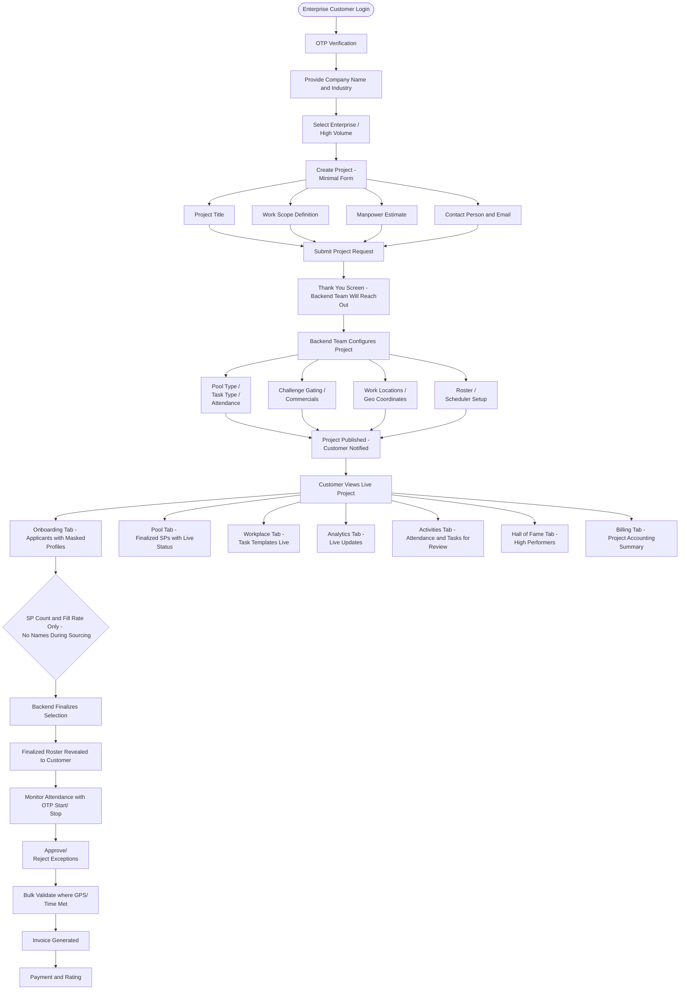
```mermaid
flowchart TD
    E1([Enterprise Customer Login]) --> E2[OTP Verification]
    E2 --> E3[Provide Company Name and Industry]
    E3 --> E4[Select Enterprise / <br/> High Volume]
    E4 --> E5[Create Project - <br/> Minimal Form]
    E5 --> E6[Project Title]
    E5 --> E7[Work Scope Definition]
    E5 --> E8[Manpower Estimate]
    E5 --> E9[Contact Person and Email]
    E6 & E7 & E8 & E9 --> E10[Submit Project Request]
    E10 --> E11[Thank You Screen - <br/> Backend Team Will Reach Out]

    E11 --> E12[Backend Team Configures Project]
    E12 --> E13[Pool Type / <br/> Task Type / <br/> Attendance]
    E12 --> E14[Challenge Gating / <br/> Commercials]
    E12 --> E15[Work Locations / <br/> Geo Coordinates]
    E12 --> E16[Roster / <br/> Scheduler Setup]
    E13 & E14 & E15 & E16 --> E17[Project Published - <br/> Customer Notified]

    E17 --> E18[Customer Views Live Project]
    E18 --> E19[Onboarding Tab - <br/> Applicants with Masked Profiles]
    E18 --> E20[Pool Tab - <br/> Finalized SPs with Live Status]
    E18 --> E21[Workplace Tab - <br/> Task Templates Live]
    E18 --> E22[Analytics Tab - <br/> Live Updates]
    E18 --> E23[Activities Tab - <br/> Attendance and Tasks for Review]
    E18 --> E24[Hall of Fame Tab - <br/> High Performers]
    E18 --> E25[Billing Tab - <br/> Project Accounting Summary]

    E19 --> E26{SP Count and Fill Rate Only - <br/> No Names During Sourcing}
    E26 --> E27[Backend Finalizes Selection]
    E27 --> E28[Finalized Roster Revealed to Customer]
    E28 --> E29[Monitor Attendance with OTP Start/ <br/>Stop]
    E29 --> E30[Approve/ <br/>Reject Exceptions]
    E30 --> E31[Bulk Validate where GPS/ <br/>Time Met]
    E31 --> E32[Invoice Generated]
    E32 --> E33[Payment and Rating]
```

### 3.3 Client Workflow - SMB

SMB customers self-serve the entire project creation, workforce selection, and monitoring process.

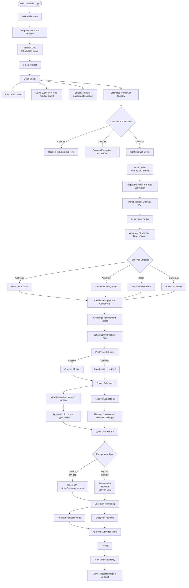
```mermaid
flowchart TD
    S1([SMB Customer Login]) --> S2[OTP Verification]
    S2 --> S3[Company Name and Industry]
    S3 --> S4[Select SMB / <br/> MSME Self-Serve]
    S4 --> S5[Create Project]

    S5 --> S6[Quick Check]
    S6 --> S6A[Provide Pincode]
    S6 --> S6B[Select Workforce Type - <br/> Field or Digital]
    S6 --> S6C[Select Job Role - <br/> Cascaded Dropdown]
    S6 --> S6D[Estimated Manpower Quantity]

    S6D --> S7{Manpower Count Check}
    S7 -->|Over 35| S7A[Redirect to Enterprise Flow]
    S7 -->|20 to 35| S7B[Suggest Enterprise Assistance]
    S7 -->|Under 20| S8[Continue Self-Serve]

    S8 --> S9[Project Title - <br/> Acts as GIG Name]
    S9 --> S10[Project Definition and Task Description]
    S10 --> S11[Work Locations with Geo Pin]
    S11 --> S12[Deployment Period]
    S12 --> S13[Workforce Timescape - <br/> Days of Week]
    S13 --> S14{Task Type Selection}
    S14 -->|Add Task| S14A[SPs Create Tasks]
    S14 -->|Assigned| S14B[Sequential Assignment]
    S14 -->|Batch| S14C[Batch with Deadline]
    S14 -->|Grab Task| S14D[Roster Scheduler]

    S14A & S14B & S14C & S14D --> S15[Attendance Toggle and Geofencing]
    S15 --> S16[Challenge Requirement Toggle]
    S16 --> S17[Define Commercial per Task]
    S17 --> S18[Pool Type Selection]
    S18 -->|Captive| S18A[Curated SP List]
    S18 -->|Common| S18B[Broadcast to Live Pool]

    S18A & S18B --> S19[Project Published]

    S19 --> S20[View AI-Matched Masked Profiles]
    S19 --> S21[Receive Applications]
    S20 --> S22[Review Portfolios and Trigger Invites]
    S21 --> S23[Filter Applications and Review Challenges]
    S22 & S23 --> S24[Open Chat with SP]
    S24 --> S25{Engagement Type}
    S25 -->|Field / <br/> On-site| S25A[Select SP - <br/> Auto Create Agreement]
    S25 -->|Digital / <br/> Remote| S25B[Review Bid - <br/> Negotiate - <br/> Confirm Deal]
    S25A & S25B --> S26[Execution Monitoring]
    S26 --> S27[Attendance Dashboards]
    S26 --> S28[Exception Handling]
    S27 & S28 --> S29[Approve Submitted Work]
    S29 --> S30[Rating]
    S30 --> S31[View Invoice and Pay]
    S31 --> S32[Clone Project for Repeat Demand]
```

### 3.4 Client Workflow - MSME

MSME follows the self-serve path but with simplified requirements and a managed execution option.

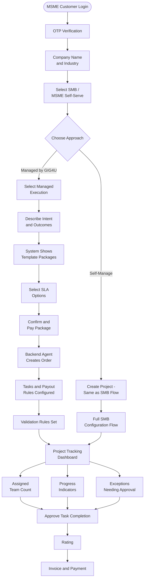
```mermaid
flowchart TD
    M1([MSME Customer Login]) --> M2[OTP Verification]
    M2 --> M3[Company Name <br/> and Industry]
    M3 --> M4[Select SMB / <br/> MSME Self-Serve]
    M4 --> M5{Choose Approach}
    M5 -->|Self-Manage| M6[Create Project - <br/> Same as SMB Flow]
    M5 -->|Managed by GIG4U| M7[Select Managed  <br/> Execution]

    M7 --> M8[Describe Intent <br/> and Outcomes]
    M8 --> M9[System Shows <br/> Template Packages]
    M9 --> M10[Select SLA <br/> Options]
    M10 --> M11[Confirm and <br/> Pay Package]
    M11 --> M12[Backend Agent <br/> Creates Order]
    M12 --> M13[Tasks and Payout <br/> Rules Configured]
    M13 --> M14[Validation Rules Set]

    M14 --> M15[Project Tracking <br/> Dashboard]
    M15 --> M16[Assigned <br/> Team Count]
    M15 --> M17[Progress <br/> Indicators]
    M15 --> M18[Exceptions <br/> Needing Approval]

    M6 --> M19[Full SMB <br/> Configuration Flow]
    M19 --> M15

    M16 & M17 & M18 --> M20[Approve Task Completion]
    M20 --> M21[Rating]
    M21 --> M22[Invoice and Payment]
```

### 3.5 Service Provider Workflow

This is the full 10-phase SP journey, building upon and extending the existing `sp experience workflow in gig4u.mmd`.


```mermaid
flowchart TD
    subgraph P1["PHASE 1 - AUTHENTICATION"]
        direction TB
        A1([SP Opens App]) --> A2[Login Screen - <br/> Phone Number Input]
        A2 --> A3{Valid 10-digit Number?}
        A3 -->|No| A2
        A3 -->|Yes| A4[Send OTP - <br/> WhatsApp Primary / <br/> SMS Fallback]
        A4 --> A5[OTP Verification <br/> - 6-Box Input <br/> / 30s Resend]
        A5 --> A6{OTP Verified?}
        A6 -->|Failed| A5
        A6 -->|Max Attempts| A7[Locked - <br/> Contact Support]
        A6 -->|Success| A8{Returning User?}
        A8 -->|New SP| A9[Create SP Record - <br/> FRESH_SIGNUP]
        A8 -->|Existing| A10[Load Last State]
        A9 & A10 --> A11[Location Permission <br/> Prompt]
    end

    subgraph P2["PHASE 2 - <br/> HOME DASHBOARD"]
        direction TB
        B1[Home Dashboard]
        B1 --> B2[Earnings Summary - <br/> Today / Week <br/> / Month]
        B1 --> B3[Active Assignments <br/> or Empty State]
        B1 --> B4[Notifications Preview]
        B1 --> B5[Quick Actions - <br/> Gated by Eligibility]
    end

    subgraph P3["PHASE 3 - <br/> PROGRESSIVE PROFILE <br/> AND KYC"]
        direction TB
        C1[Profile Screen <br/> with Completion <br/> Banner]
        C1 --> C2[Basic Profile - <br/> Name / Photo <br/> / City / Roles]
        C1 --> C3[KYC Sections - <br/> Personal / Address <br/> / PAN / Aadhaar / <br/> Bank]
        C1 --> C4[Document Vault <br/> - PAN / Aadhaar <br/> / Police / <br/> Certificates]
        C1 --> C5[Payment Setup <br/> - Bank Account <br/> or UPI]
        C3 --> C3A{KYC Item Status}
        C3A -->|Pending| C3B[Fill and <br/> Submit Form]
        C3A -->|Under Review| C3C[Review Badge]
        C3A -->|Verified| C3D[Verified Badge]
    end

    subgraph P4["PHASE 4 - <br/> JOB DISCOVERY"]
        direction TB
        D1[Gigs Screen - <br/> No Gate Required]
        D1 --> D2[Job Cards <br/> - Role / Location <br/> / Pay / Duration]
        D1 --> D3[Filters and <br/> Sorting]
        D1 --> D4[AI-Powered <br/> Suggestions]
        D2 --> D5[Job Detail <br/> View]
        D5 --> D6{Job Type?}
        D6 -->|Marketplace| D7[Apply CTA <br/> - Gated by <br/> Profile]
        D6 -->|Managed / Enterprise| D8[View Assignment <br/> - Accept CTA]
    end

    subgraph P5["PHASE 5 - <br/> APPLICATION AND <br/> ASSIGNMENT"]
        direction TB
        E1{Profile Basics <br/> Complete?}
        E1 -->|No| E2[Prompt to <br/> Complete Profile]
        E1 -->|Yes| E3{Challenge Required?}
        E3 -->|No| E6[Submit Application]
        E3 -->|Yes| E4[Challenge - <br/> Video / MCQ <br/> / Coding]
        E4 --> E4A[AI Scores Challenge]
        E4A --> E6
        E6 --> E7[Application Tracking]
        E7 -->|Selected| E8[Chat Negotiation <br/> and Confirm]
        E7 -->|Not Selected| E9[Apply Again]
        E8 --> E10[Assignment Confirmed <br/> - SP ACTIVE]

        F1[Managed Assignment <br/> Pushed to SP]
        F1 --> F2{KYC Complete?}
        F2 -->|No| F3[Block Accept <br/> with Reason]
        F2 -->|Yes| F4[Assignment Detail <br/> - Read-only]
        F4 --> F5[Accept Assignment]
    end

    subgraph P6["PHASE 6 - <br/> TASK EXECUTION"]
        direction TB
        G1{Task Type <br/> Assigned}
        G1 -->|Add| G2[SP Creates <br/> Task Record <br/> and Uploads <br/>Evidence]
        G1 -->|Assigned| G3[Complete Task <br/> 1 then Unlock <br/> Task 2]
        G1 -->|Batch| G4[Work Through <br/> Batch in Time <br/> Window]
        G1 -->|Grab| G5[Browse and <br/> Confirm Available <br/> Slots]
        G2 & G3 & G4 & G5 --> G_DONE([Task Ready <br/> for Attendance])
    end

    subgraph P7["PHASE 7 - <br/>ATTENDANCE AND <br/>SHIFT OTP"]
        direction TB
        H1{Attendance Required?}
        H1 -->|No| H_SKIP[Proceed to Evidence]
        H1 -->|Yes| H2{Shift OTP Required?}
        H2 -->|Yes| H3[Shift OTP - <br/> Bound to Assignment <br/>ID]
        H3 --> H4[Mark In - <br/>GPS Validated]
        H2 -->|No| H4
        H4 --> H5{Inside Geo <br/>Radius?}
        H5 -->|No| H6[Exception Raised]
        H5 -->|Yes| H7[Live Timer Starts]
        H7 --> H8[Mark Out]
        H8 --> H9{Auto-Validation<br/> Result}
        H9 -->|AUTO_APPROVED| H_DONE([Attendance Recorded])
        H9 -->|EXCEPTION| H10[Exception Logged <br/>and Routed]
        H_SKIP --> H_DONE
    end

    subgraph P8["PHASE 8 - <br/>EVIDENCE SUBMISSION"]
        direction TB
        I1[Evidence Checklist <br/>from Backend Policy]
        I1 --> I2[Submit Evidence - <br/>Photo / Video / <br/>GPS / Form / OTP]
        I2 --> I3{All Items Complete?}
        I3 -->|No| I4[Missing Items <br/>Flagged]
        I4 --> I2
        I3 -->|Yes| I5[Submit Task - <br/>Status SUBMITTED]
        I5 --> I6{Review Outcome}
        I6 -->|Approved| I_DONE([Task APPROVED])
        I6 -->|Rejected| I7[Rejection Reason - <br/>Resubmit Option]
    end

    subgraph P9["PHASE 9 -<br/> BILLING AND<br/> PAYOUT"]
        direction TB
        J1[Bill Auto-Generated <br/>Post Approval]
        J1 --> J2[Bill Submitted - <br/>IN_REVIEW]
        J2 --> J3{Bill Review}
        J3 -->|Approved| J4[Payout via <br/>Razorpay]
        J3 -->|Rejected| J5[Rejection Reason <br/>- Dispute CTA]
        J3 -->|Duplicate| J6[Flagged - <br/>No Payout]
        J4 --> J7{Payout Status}
        J7 -->|Paid| J10[Reference ID <br/>Shown - Ledger <br/>Updated]
        J7 -->|Failed| J9[Failure Reason<br/> - Retry Available]
    end

    subgraph P10["PHASE 10 - <br/>NOTIFICATIONS AND<br/> BEHAVIORAL BRAIN"]
        direction TB
        K1[Event Triggers - OTP <br/>/ Assignment / <br/>Exception / Bill]
        K1 --> K2[Channels - In-App<br/> / WhatsApp / <br/>SMS]
        K1 --> K3[Telemetry Events <br/>Captured]
        K3 --> K4[Behavioral <br/>Brain Score]
        K4 --> K5[Feeds into AI <br/>Matching and Discovery]
    end

    A11 --> B1
    B1 --> C1
    B1 --> D1
    D7 --> E1
    D8 --> F1
    E10 --> G1
    F5 --> G1
    G_DONE --> H1
    H_DONE --> I1
    I_DONE --> J1
    J10 --> K1
    K5 -.->|Influences ranking| D4
```

### 3.6 Admin Control Panel Workflow

The Admin Control Plane is not a CRUD panel — it is a Work Configuration Studio.


```mermaid
flowchart TD
    ADM1([Admin Login <br/>with 2FA]) --> ADM2{Admin Role}
    ADM2 -->|Super Admin| ADM3[Full Access]
    ADM2 -->|Ops Admin| ADM4[Operational Queue]
    ADM2 -->|KYC Admin| ADM5[KYC Review Queue]
    ADM2 -->|Finance Admin| ADM6[Billing and Payouts]
    ADM2 -->|Enterprise Ops| ADM7[Enterprise Account<br/> Management]

    ADM3 & ADM4 & ADM5 & ADM6 & ADM7 --> ADM8[Admin Dashboard <br/>- Today Queue]

    subgraph CONFIG["Configuration<br/> Studio"]
        direction TB
        CFG1[Categories <br/>and Job Roles]
        CFG2[Task Types and<br/> Evidence Policies]
        CFG3[Attendance Policies]
        CFG4[Payout Rules]
        CFG5[Product Bundles <br/>and Pricing <br/>Plans]
        CFG6[Forms and <br/>Field Pool <br/>Builder]
        CFG7[Notification <br/>Templates]
        CFG8[Visibility and <br/>Retention <br/>Policies]
        CFG9[RBAC Entitlements]
        CFG10[Challenge <br/>Template Library]
    end

    subgraph KYC_REVIEW["KYC and SP <br/>Management"]
        direction TB
        KYC1[SP Self-Signups Queue]
        KYC2[PAN / Aadhaar <br/>/ Police Verification <br/>Review]
        KYC3[Approve or <br/>Reject Documents]
        KYC4[Assign Skills <br/>and Roles]
        KYC5[Suspend / <br/>Reactivate Accounts]
    end

    subgraph ENT_OPS["Enterprise Operations"]
        direction TB
        ENT1[View Enterprise <br/>Intake Submissions]
        ENT2[Contact Customer <br/>and Finalize Scope]
        ENT3[Populate Project <br/>Configuration]
        ENT4[Create Rosters and <br/>Task Instances]
        ENT5[Monitor Fill Rates <br/>and Risk Flags]
        ENT6[Handle Exceptions <br/>and No-Shows]
        ENT7[Trigger Billing <br/>and Payout Cycles]
    end

    subgraph FINANCE_OPS["Finance Operations"]
        direction TB
        FIN1[Invoice Generation]
        FIN2[Bill Review - <br/>Approve / Reject<br/> / Duplicate]
        FIN3[Payout Approval <br/>and Execution]
        FIN4[Dispute Resolution]
        FIN5[Margin Tracking]
        FIN6[Ledger Audit - <br/>Immutable]
    end

    subgraph OPS_MONITOR["Operations Monitoring"]
        direction TB
        OPS1[Attendance Anomalies]
        OPS2[GPS and Time Violations]
        OPS3[Customer Approval <br/>Pending]
        OPS4[Chat Moderation]
        OPS5[Fraud Review]
    end

    ADM8 --> CONFIG
    ADM8 --> KYC_REVIEW
    ADM8 --> ENT_OPS
    ADM8 --> FINANCE_OPS
    ADM8 --> OPS_MONITOR

    KYC3 --> KYC4
    ENT3 --> ENT4
    ENT4 --> ENT5
    FIN2 --> FIN3
```

---

## 4. User Experience Analysis

### 4.1 Service Provider Experience

**Design Philosophy: Progressive Gating, Mobile-First, AI-Powered Discovery**

The SP App is not just an app — it is a **Human Operating System** with a value loop:

```
Get Verified -> Execute Work -> Build Trust -> Earn More -> Get Better Work
```

**Progressive Gating Rules (No Hard Blocks):**

| Action | Requirement |
|--------|------------|
| Browse jobs | None |
| View content and training | None |
| Apply to job | Profile basics required |
| Accept task assignment | KYC required |
| Mark attendance | GPS + Device required |
| Receive payout | Bank + PAN required |

**Key UX Principles:**

- **Immediate Value:** Jobs visible immediately after OTP login — browsing is never blocked
- **Progressive Enablement:** Each disabled CTA shows the reason and a "Fix" action
- **AI Discovery:** Job recommendations based on profile + behavioral score + location
- **Challenge Portfolio:** Video/MCQ/Coding challenges build a reusable portfolio that improves ranking
- **Behavioral Scoring:** ~20 telemetry events feed into reliability score, affecting job visibility
- **Earnings Transparency:** Real-time earnings display with bill status tracking and dispute capability

**SP Status Lifecycle:**
`FRESH_SIGNUP -> PROFILE_INCOMPLETE -> PROFILE_COMPLETE -> ACTIVE -> INACTIVE -> DORMANT -> BLACKLISTED`

Dormant users can reactivate via OTP. All transitions are system-controlled and logged.

### 4.2 Client Experience by Type

#### Enterprise: Minimal Touchpoints

- **Onboarding:** Login, company name, industry, select Enterprise
- **Project Creation:** 4 simple fields (title, scope, manpower, contact) — submit and wait
- **Backend Does:** Pool configuration, task types, attendance rules, challenges, commercials, roster creation
- **Customer Sees:** Live project with pre-populated fields, tabbed interface (Onboarding, Pool, Workplace, Analytics, Activities, Hall of Fame, Billing)
- **Identity Masking:** During sourcing, only SP count and fill rate visible — names revealed after finalization lock
- **Modular Features:** Each tab/feature enabled by backend per customer RBAC settings

#### SMB: Self-Serve with Full Control

- **Full Project Configuration:** Workforce type, job role (cascaded), locations with geo-pins, deployment period, timescape, task type, attendance/geofencing, challenges, commercials
- **Workforce Discovery:** View AI-matched masked profiles, receive applications, review challenge submissions
- **Engagement:** Open monitored chat, negotiate terms (fixed for field, bidding for digital), finalize agreement
- **Monitoring:** Attendance dashboards, exception handling, task approval, rating, billing
- **Repeat Demand:** Clone project/roster for recurring needs

#### MSME: Guided with Managed Option

- **Dual Path:** Can self-serve (like SMB) or choose "Managed by GIG4U"
- **Managed Path:** Describe outcomes, select template package, platform handles execution
- **Monitoring:** Simplified progress dashboard — assigned team count, progress, exceptions

### 4.3 Admin Experience

**The Admin Control Plane is a programmable configuration studio, not a CRUD panel.**

**Role-Based Views:**

| Role | Primary Focus |
|------|--------------|
| Super Admin | Full platform configuration and access |
| Ops Admin | Daily operational queue — exceptions, anomalies, chat moderation |
| KYC Admin | Document verification — approve/reject PAN, Aadhaar, Police, Bank |
| Finance Admin | Bill review, payout approval, dispute resolution, margin tracking |
| Enterprise Ops | Enterprise intake processing, project configuration, roster management |
| Customer Support | Chat moderation, dispute handling, fraud review |

**Key Admin Capabilities:**
- Define task types, evidence policies, attendance rules, payout logic
- Build custom forms with field component pool
- Manage challenge template library
- Configure RBAC entitlements and feature gating (especially for enterprise modular unlocks)
- Set data retention and destruction policies
- Monitor immutable audit trail

---

## 5. Journey Diagrams

### 5.1 Client Journey - Enterprise

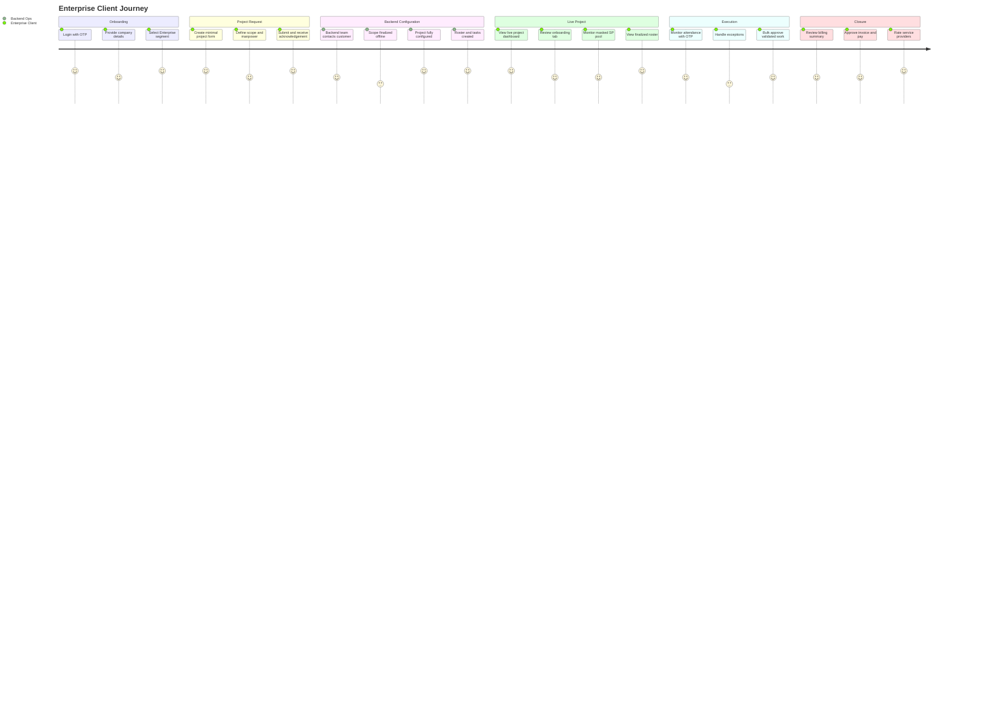
```mermaid
journey
    title Enterprise Client Journey
    section Onboarding
      Login with OTP: 5: Enterprise Client
      Provide company details: 4: Enterprise Client
      Select Enterprise segment: 5: Enterprise Client
    section Project Request
      Create minimal project form: 5: Enterprise Client
      Define scope and manpower: 4: Enterprise Client
      Submit and receive acknowledgement: 5: Enterprise Client
    section Backend Configuration
      Backend team contacts customer: 4: Backend Ops
      Scope finalized offline: 3: Backend Ops
      Project fully configured: 5: Backend Ops
      Roster and tasks created: 5: Backend Ops
    section Live Project
      View live project dashboard: 5: Enterprise Client
      Review onboarding tab: 4: Enterprise Client
      Monitor masked SP pool: 4: Enterprise Client
      View finalized roster: 5: Enterprise Client
    section Execution
      Monitor attendance with OTP: 4: Enterprise Client
      Handle exceptions: 3: Enterprise Client
      Bulk approve validated work: 4: Enterprise Client
    section Closure
      Review billing summary: 4: Enterprise Client
      Approve invoice and pay: 4: Enterprise Client
      Rate service providers: 5: Enterprise Client
```

### 5.2 Client Journey - SMB

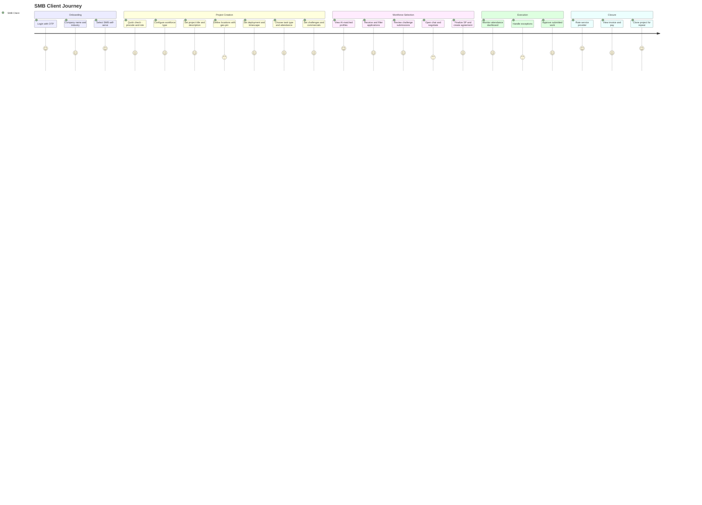
```mermaid
journey
    title SMB Client Journey
    section Onboarding
      Login with OTP: 5: SMB Client
      Company name and industry: 4: SMB Client
      Select SMB self-serve: 5: SMB Client
    section Project Creation
      Quick check - pincode and role: 4: SMB Client
      Configure workforce type: 4: SMB Client
      Set project title and description: 4: SMB Client
      Define locations with geo-pin: 3: SMB Client
      Set deployment and timescape: 4: SMB Client
      Choose task type and attendance: 4: SMB Client
      Set challenges and commercials: 4: SMB Client
    section Workforce Selection
      View AI-matched profiles: 5: SMB Client
      Receive and filter applications: 4: SMB Client
      Review challenge submissions: 4: SMB Client
      Open chat and negotiate: 3: SMB Client
      Finalize SP and create agreement: 4: SMB Client
    section Execution
      Monitor attendance dashboard: 4: SMB Client
      Handle exceptions: 3: SMB Client
      Approve submitted work: 4: SMB Client
    section Closure
      Rate service provider: 5: SMB Client
      View invoice and pay: 4: SMB Client
      Clone project for repeat: 5: SMB Client
```

### 5.3 Client Journey - MSME

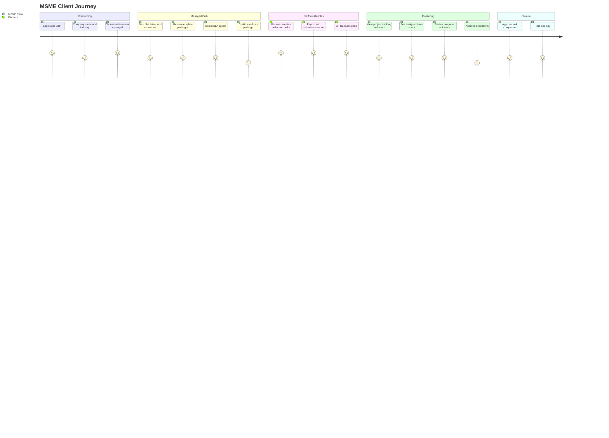
```mermaid
journey
    title MSME Client Journey
    section Onboarding
      Login with OTP: 5: MSME Client
      Company name and industry: 4: MSME Client
      Choose self-serve or managed: 5: MSME Client
    section Managed Path
      Describe intent and outcomes: 4: MSME Client
      Review template packages: 4: MSME Client
      Select SLA option: 4: MSME Client
      Confirm and pay package: 3: MSME Client
    section Platform Handles
      Backend creates order and tasks: 5: Platform
      Payout and validation rules set: 5: Platform
      SP team assigned: 5: Platform
    section Monitoring
      View project tracking dashboard: 4: MSME Client
      See assigned team count: 4: MSME Client
      Review progress indicators: 4: MSME Client
      Approve exceptions: 3: MSME Client
    section Closure
      Approve task completion: 4: MSME Client
      Rate and pay: 4: MSME Client
```

### 5.4 Service Provider Journey


```mermaid
journey
    title Service Provider Journey
    section Authentication
      Download and open app: 5: SP
      Grant location permission: 4: SP
      Enter phone number: 5: SP
      Verify OTP via WhatsApp: 5: SP
    section Discovery
      Land on home dashboard: 5: SP
      Browse job listings immediately: 5: SP
      Apply filters and sort: 4: SP
      View AI-powered suggestions: 4: SP
    section Profile Building
      Complete basic profile: 4: SP
      Submit KYC documents: 3: SP
      Upload to document vault: 3: SP
      Set up payment method: 4: SP
    section Applying
      Open job detail view: 5: SP
      Complete challenge if required: 3: SP
      Submit application: 4: SP
      Track application status: 4: SP
      Negotiate via chat if selected: 4: SP
    section Task Execution
      Receive and accept assignment: 5: SP
      Mark attendance with GPS: 4: SP
      Complete task requirements: 4: SP
      Submit evidence: 3: SP
    section Payout
      View auto-generated bill: 4: SP
      Track bill review status: 4: SP
      Receive payout via Razorpay: 5: SP
      Check earnings dashboard: 5: SP
    section Growth
      Build challenge portfolio: 4: SP
      Improve behavioral score: 4: SP
      Get better ranked jobs: 5: SP
```

### 5.5 Admin Journey

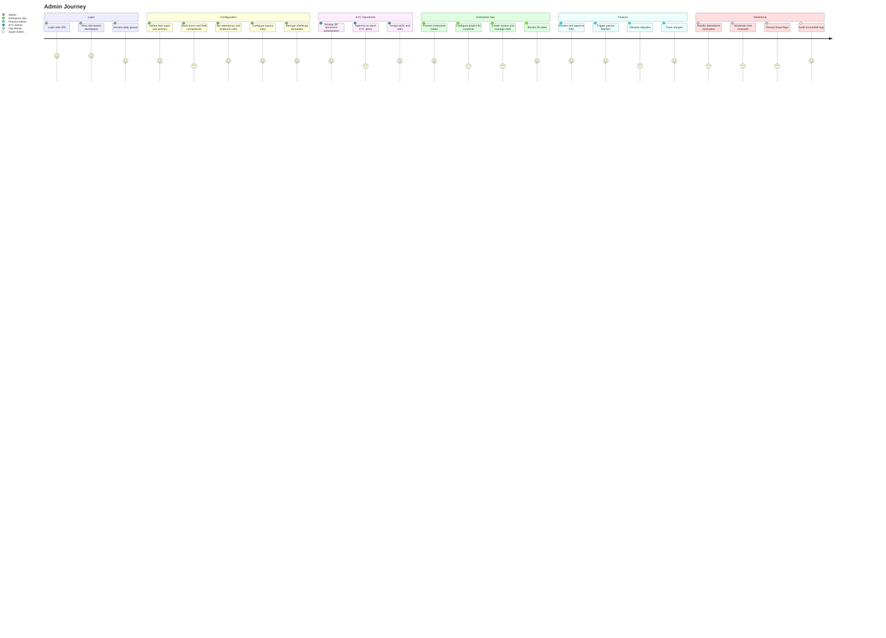
```mermaid
journey
    title Admin Journey
    section Login
      Login with 2FA: 5: Admin
      View role-based dashboard: 5: Admin
      Review daily queue: 4: Admin
    section Configuration
      Define task types and policies: 4: Admin
      Build forms and field components: 3: Admin
      Set attendance and evidence rules: 4: Admin
      Configure payout rules: 4: Admin
      Manage challenge templates: 4: Admin
    section KYC Operations
      Review SP document submissions: 4: KYC Admin
      Approve or reject KYC items: 3: KYC Admin
      Assign skills and roles: 4: KYC Admin
    section Enterprise Ops
      Process enterprise intake: 4: Enterprise Ops
      Configure project for customer: 3: Enterprise Ops
      Create rosters and manage slots: 3: Enterprise Ops
      Monitor fill rates: 4: Enterprise Ops
    section Finance
      Review and approve bills: 4: Finance Admin
      Trigger payout batches: 4: Finance Admin
      Resolve disputes: 3: Finance Admin
      Track margins: 4: Finance Admin
    section Monitoring
      Handle attendance anomalies: 3: Ops Admin
      Moderate chat channels: 3: Ops Admin
      Review fraud flags: 3: Ops Admin
      Audit immutable logs: 4: Super Admin
```

---

## 6. State Diagrams

### 6.1 SP Status State Machine

The Service Provider progresses through a defined lifecycle. All transitions are logged immutably.

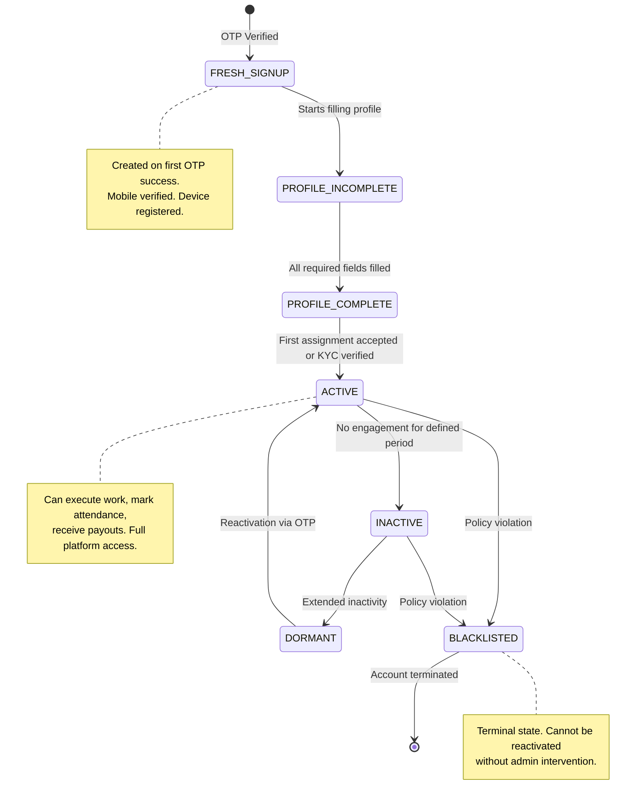
```mermaid
stateDiagram-v2
    [*] --> FRESH_SIGNUP : OTP Verified
    FRESH_SIGNUP --> PROFILE_INCOMPLETE : Starts filling profile
    PROFILE_INCOMPLETE --> PROFILE_COMPLETE : All required fields filled
    PROFILE_COMPLETE --> ACTIVE : First assignment accepted or KYC verified
    ACTIVE --> INACTIVE : No engagement for defined period
    INACTIVE --> DORMANT : Extended inactivity
    DORMANT --> ACTIVE : Reactivation via OTP
    ACTIVE --> BLACKLISTED : Policy violation
    INACTIVE --> BLACKLISTED : Policy violation
    BLACKLISTED --> [*] : Account terminated

    note right of FRESH_SIGNUP
        Created on first OTP success.
        Mobile verified. Device registered.
    end note

    note right of ACTIVE
        Can execute work, mark attendance,
        receive payouts. Full platform access.
    end note

    note right of BLACKLISTED
        Terminal state. Cannot be reactivated
        without admin intervention.
    end note
```

### 6.2 Task Lifecycle State Machine

Tasks follow different paths depending on the operating mode.

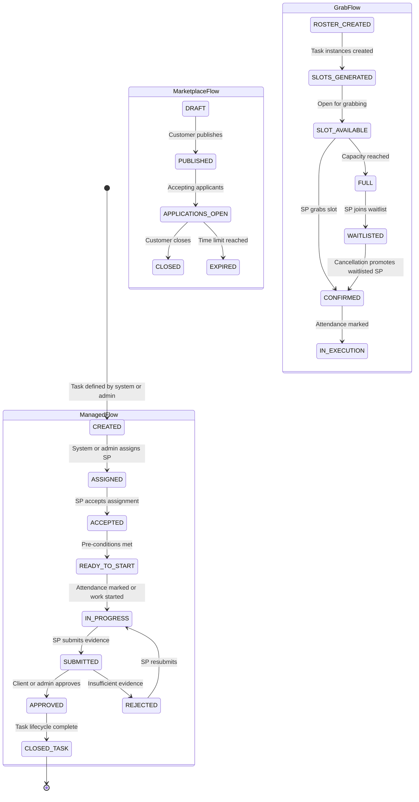
```mermaid
stateDiagram-v2
    [*] --> CREATED : Task defined by system or admin

    state MarketplaceFlow {
        DRAFT --> PUBLISHED : Customer publishes
        PUBLISHED --> APPLICATIONS_OPEN : Accepting applicants
        APPLICATIONS_OPEN --> CLOSED : Customer closes
        APPLICATIONS_OPEN --> EXPIRED : Time limit reached
    }

    state ManagedFlow {
        CREATED --> ASSIGNED : System or admin assigns SP
        ASSIGNED --> ACCEPTED : SP accepts assignment
        ACCEPTED --> READY_TO_START : Pre-conditions met
        READY_TO_START --> IN_PROGRESS : Attendance marked or work started
        IN_PROGRESS --> SUBMITTED : SP submits evidence
        SUBMITTED --> APPROVED : Client or admin approves
        SUBMITTED --> REJECTED : Insufficient evidence
        REJECTED --> IN_PROGRESS : SP resubmits
        APPROVED --> CLOSED_TASK : Task lifecycle complete
    }

    state GrabFlow {
        ROSTER_CREATED --> SLOTS_GENERATED : Task instances created
        SLOTS_GENERATED --> SLOT_AVAILABLE : Open for grabbing
        SLOT_AVAILABLE --> CONFIRMED : SP grabs slot
        SLOT_AVAILABLE --> FULL : Capacity reached
        FULL --> WAITLISTED : SP joins waitlist
        WAITLISTED --> CONFIRMED : Cancellation promotes waitlisted SP
        CONFIRMED --> IN_EXECUTION : Attendance marked
    }

    CLOSED_TASK --> [*]
```

### 6.3 Bill Lifecycle State Machine

Bills are auto-generated post task approval. Ledger entries are immutable.

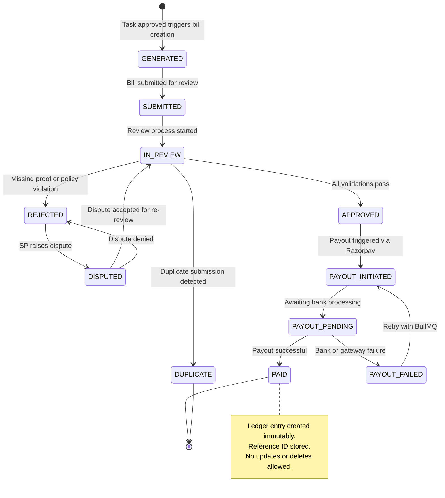
```mermaid
stateDiagram-v2
    [*] --> GENERATED : Task approved triggers bill creation

    GENERATED --> SUBMITTED : Bill submitted for review
    SUBMITTED --> IN_REVIEW : Review process started

    IN_REVIEW --> APPROVED : All validations pass
    IN_REVIEW --> REJECTED : Missing proof or policy violation
    IN_REVIEW --> DUPLICATE : Duplicate submission detected

    REJECTED --> DISPUTED : SP raises dispute
    DISPUTED --> IN_REVIEW : Dispute accepted for re-review
    DISPUTED --> REJECTED : Dispute denied

    APPROVED --> PAYOUT_INITIATED : Payout triggered via Razorpay
    PAYOUT_INITIATED --> PAYOUT_PENDING : Awaiting bank processing
    PAYOUT_PENDING --> PAID : Payout successful
    PAYOUT_PENDING --> PAYOUT_FAILED : Bank or gateway failure
    PAYOUT_FAILED --> PAYOUT_INITIATED : Retry with BullMQ

    PAID --> [*]
    DUPLICATE --> [*]

    note right of PAID
        Ledger entry created immutably.
        Reference ID stored.
        No updates or deletes allowed.
    end note
```

### 6.4 Attendance Session State Machine

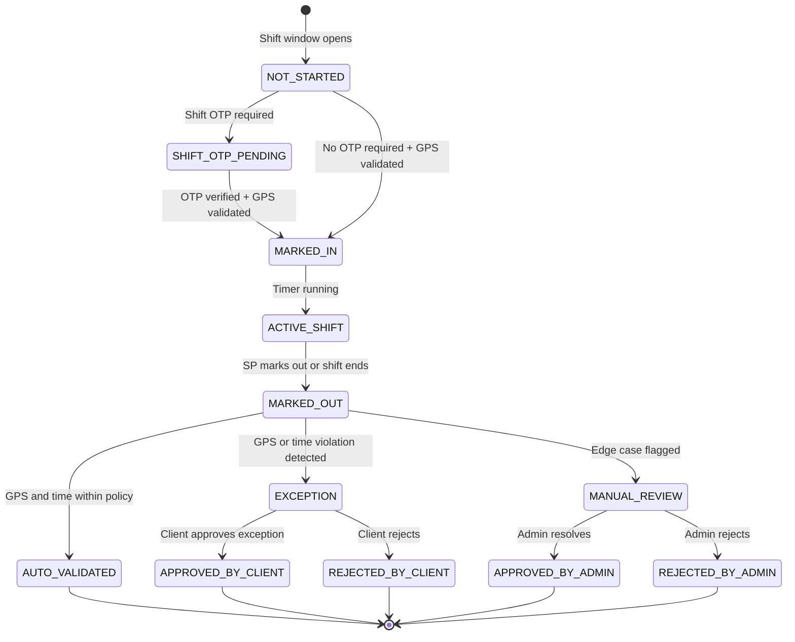
```mermaid
stateDiagram-v2
    [*] --> NOT_STARTED : Shift window opens

    NOT_STARTED --> SHIFT_OTP_PENDING : Shift OTP required
    SHIFT_OTP_PENDING --> MARKED_IN : OTP verified + GPS validated
    NOT_STARTED --> MARKED_IN : No OTP required + GPS validated

    MARKED_IN --> ACTIVE_SHIFT : Timer running
    ACTIVE_SHIFT --> MARKED_OUT : SP marks out or shift ends

    MARKED_OUT --> AUTO_VALIDATED : GPS and time within policy
    MARKED_OUT --> EXCEPTION : GPS or time violation detected
    MARKED_OUT --> MANUAL_REVIEW : Edge case flagged

    EXCEPTION --> APPROVED_BY_CLIENT : Client approves exception
    EXCEPTION --> REJECTED_BY_CLIENT : Client rejects
    MANUAL_REVIEW --> APPROVED_BY_ADMIN : Admin resolves
    MANUAL_REVIEW --> REJECTED_BY_ADMIN : Admin rejects

    AUTO_VALIDATED --> [*]
    APPROVED_BY_CLIENT --> [*]
    APPROVED_BY_ADMIN --> [*]
    REJECTED_BY_CLIENT --> [*]
    REJECTED_BY_ADMIN --> [*]
```

### 6.5 Marketplace Application State Machine

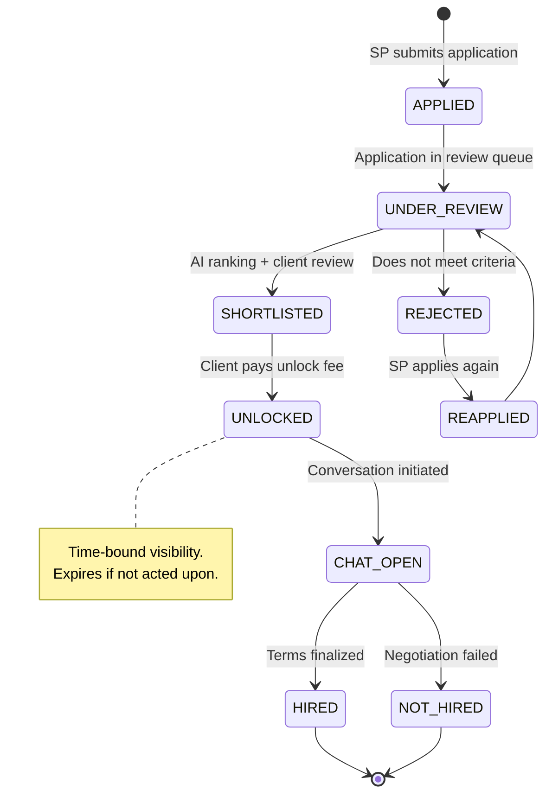
```mermaid
stateDiagram-v2
    [*] --> APPLIED : SP submits application

    APPLIED --> UNDER_REVIEW : Application in review queue
    UNDER_REVIEW --> SHORTLISTED : AI ranking + client review
    UNDER_REVIEW --> REJECTED : Does not meet criteria

    SHORTLISTED --> UNLOCKED : Client pays unlock fee
    UNLOCKED --> CHAT_OPEN : Conversation initiated
    CHAT_OPEN --> HIRED : Terms finalized
    CHAT_OPEN --> NOT_HIRED : Negotiation failed

    REJECTED --> REAPPLIED : SP applies again
    REAPPLIED --> UNDER_REVIEW

    HIRED --> [*]
    NOT_HIRED --> [*]

    note right of UNLOCKED
        Time-bound visibility.
        Expires if not acted upon.
    end note
```

---
---
---

# GIG4U - Solution Architect Brief


---

## Table of Contents

1. [Executive Summary](#1-executive-summary)
2. [Stakeholder Analysis](#2-stakeholder-analysis)
3. [Functional Requirements](#3-functional-requirements)
4. [Non-Functional Requirements](#4-non-functional-requirements)
5. [Data Flow Overview](#5-data-flow-overview)
6. [Integration Points](#6-integration-points)
7. [Technology Stack](#7-technology-stack)
8. [Security & RBAC Requirements](#8-security--rbac-requirements)
9. [Database Schema Considerations](#9-database-schema-considerations)
10. [API Design Considerations](#10-api-design-considerations)
11. [Deployment Architecture Considerations](#11-deployment-architecture-considerations)
12. [Scalability Considerations](#12-scalability-considerations)
13. [AI & Dynamic Attributes](#13-ai--dynamic-attributes)
14. [Key Architectural Decisions](#14-key-architectural-decisions)
15. [Module Dependency Map](#15-module-dependency-map)
16. [Source Document References](#16-source-document-references)

---

## 1. Executive Summary

### Platform Identity

**GIG4U** is a **Work Orchestration Platform** for on-demand, distributed human tasks. It manages the full lifecycle of human work — from demand creation through execution, validation, billing, and payout — across three distinct operating modes.

### Operating Modes

| Mode | Customer Type | Platform Role | Key Differentiator |
|------|--------------|---------------|-------------------|
| **Marketplace** | Retail, Individuals | Discovery facilitator | Identity/discovery/access guaranteed; outcome NOT guaranteed |
| **Managed Execution** | Field services, Multi-day tasks | Full delivery owner | Outcome/quality/replacement guaranteed; OTP/GPS/evidence enforced |
| **Enterprise Orchestration** | Large brands, Corporates | Invisible infrastructure | Identity masking during sourcing; enterprise sees results not people |

### Core Primitives

- **Work**: Any unit of human effort with start condition, validation criteria, and payout rule
- **Executor**: Verified human node with availability, skills, location, and trust score
- **Orchestrator**: Party wanting work done without managing humans (customer, enterprise, or GIG4U itself)

### MVP Scope

- **Target Go-Live:** April 17, 2026 (60-day build)
- **Approach:** Clean-slate rollout; invite users to new platform; no legacy migration
- **Delivery Phases:**
  - Phase 1: Identity, Tenancy, Control Plane skeleton, SP onboarding, Marketplace
  - Phase 2: Managed execution, Evidence, Attendance, Billing
  - Phase 3: Enterprise orchestration, masking, OTP shifts, invoicing
  - Phase 4: Partner portal, advanced pricing, SLA dashboards

---

## 2. Stakeholder Analysis

### User Types and Roles

#### Service Provider (Executor)

| State | Description |
|-------|-------------|
| FRESH_SIGNUP | OTP verified, device registered |
| PROFILE_INCOMPLETE | Started filling profile |
| PROFILE_COMPLETE | All required fields filled |
| ACTIVE | Executing work, full platform access |
| INACTIVE | No engagement for defined period |
| DORMANT | Extended inactivity, access paused |
| BLACKLISTED | Terminal — policy violation |

#### Customer Users

| Role | Permissions |
|------|------------|
| CUSTOMER_OWNER | Create/edit/cancel/override projects, full access |
| CUSTOMER_MANAGER | View/monitor projects and workforce |
| CUSTOMER_APPROVER | Approve tasks, rate SPs, authorize payments |
| CUSTOMER_VIEWER | Read-only access to project data |

#### Admin Users

| Role | Scope |
|------|-------|
| ADMIN_SUPER | Full platform configuration and access |
| ADMIN_OPS | Daily operational queue, exception handling, chat moderation |
| ADMIN_KYC | SP document verification (approve/reject) |
| ADMIN_FINANCE | Bill review, payout approval, dispute resolution, margin tracking |
| ADMIN_ENTERPRISE | Enterprise intake processing, project configuration, roster management |

#### Partner Users (v1.5)

| Role | Scope |
|------|-------|
| PARTNER_OWNER | Full partner scope operations |
| PARTNER_MANAGER | Operational management within assigned scope |
| PARTNER_VIEWER | Read-only access |

### RBAC Matrix

| Capability | SP_EXECUTOR | CUST_OWNER | CUST_MANAGER | CUST_APPROVER | CUST_VIEWER | ADMIN_SUPER | ADMIN_OPS | ADMIN_KYC | ADMIN_FINANCE | ADMIN_ENTERPRISE |
|-----------|:-----------:|:----------:|:------------:|:-------------:|:-----------:|:-----------:|:---------:|:---------:|:-------------:|:----------------:|
| View own profile | Y | - | - | - | - | Y | - | Y | - | - |
| Browse jobs | Y | - | - | - | - | - | - | - | - | - |
| Apply to jobs | Y | - | - | - | - | - | - | - | - | - |
| Create project | - | Y | - | - | - | Y | - | - | - | Y |
| Edit project | - | Y | - | - | - | Y | Y | - | - | Y |
| View applicants | - | Y | Y | Y | Y | Y | Y | - | - | Y |
| Approve tasks | - | Y | - | Y | - | Y | Y | - | - | Y |
| View billing | - | Y | Y | - | Y | Y | - | - | Y | Y |
| Authorize payment | - | Y | - | Y | - | Y | - | - | Y | - |
| Verify KYC docs | - | - | - | - | - | Y | - | Y | - | - |
| Configure task types | - | - | - | - | - | Y | - | - | - | - |
| Manage payouts | - | - | - | - | - | Y | - | - | Y | - |
| Enterprise config | - | - | - | - | - | Y | - | - | - | Y |
| View audit logs | - | - | - | - | - | Y | - | - | - | - |

**RBAC Enforcement Rule:** Permissions are deny-by-default, enforced at module-level, action-level, and field-level, always server-side (never frontend-only).

---

## 3. Functional Requirements

### Module 1: Auth & Identity

**Purpose:** Unified authentication for all platform surfaces.

| Requirement | Detail |
|-------------|--------|
| Login mechanism | OTP-based; WhatsApp primary, SMS fallback |
| OTP specs | 6-digit, 5-minute validity, 30s resend cooldown, max 3 resends, max 5 attempts |
| Session management | JWT tokens, device registration, session expiry |
| Shift OTP | Separate from login OTP; bound to `task_assignment_id` and time window; OTP reuse prohibited |
| User types | SP, Customer, Admin, Partner — all in unified `users` table |
| Device registry | Track SP device (device_id, OS, app_version, last_seen) |

**Critical Rule:** Login OTP and Shift OTP must be logically and visually distinct. Shift OTP is bound to a specific assignment.

### Module 2: Customer/Tenancy Management

**Purpose:** Multi-tenant isolation with customer segmentation.

| Requirement | Detail |
|-------------|--------|
| Tenant model | Customer Account = Tenant; `tenant_id` (UUID) on all tenant-owned tables |
| Query enforcement | All queries filter by `tenant_id` unless role = ADMIN_SUPER |
| Customer types | SMB/MSME (self-serve) and Enterprise (managed by backend) |
| Onboarding | OTP login -> company name + industry -> segment selection |
| Enterprise intake | Minimal form (title, scope, manpower, contact) -> backend configures rest |
| Tenant settings | Configurable per-tenant: visibility policies, data retention, RBAC entitlements |
| Data isolation | Enterprise data is client-isolated; no cross-tenant data leakage |
| Data retention | Policy-driven: anonymize (default) or hard delete; audit logs and ledger entries never deleted |

### Module 3: Service Provider Management

**Purpose:** Full SP lifecycle from signup through billing.

| Requirement | Detail |
|-------------|--------|
| Signup | First OTP = account creation; status = FRESH_SIGNUP |
| Profile | Name, photo, city, preferred roles, skills, location preferences |
| KYC | Personal info, address, PAN, Aadhaar, bank — each with independent status (PENDING/VERIFIED/REJECTED) |
| Document vault | PAN, Aadhaar, Police verification, Certificates — upload via camera/gallery/PDF |
| Payment setup | Bank account or UPI ID linked to Razorpay Payouts |
| Progressive gating | Browse=none, Apply=profile, Accept=KYC, Attend=GPS+device, Payout=bank+PAN |
| Status machine | FRESH_SIGNUP -> PROFILE_INCOMPLETE -> PROFILE_COMPLETE -> ACTIVE -> INACTIVE -> DORMANT -> BLACKLISTED |
| Public portfolio | Optional public page with ratings, tasks completed, challenge badges; no contact info; monitored chat only |

### Module 4: Marketplace Engine

**Purpose:** Discovery-mode job posting and application flow.

| Requirement | Detail |
|-------------|--------|
| Job posting | Customer creates marketplace job with title, description, location, pay, requirements |
| Job states | DRAFT -> PUBLISHED -> APPLICATIONS_OPEN -> CLOSED / EXPIRED |
| Application states | APPLIED -> SHORTLISTED / REJECTED -> HIRED / NOT_HIRED |
| Unlock model | Applicant profiles locked; customer pays unlock fee for visibility (time-bound) |
| AI matching | Ranked candidate list based on role, skills, location, ratings, behavioral score |
| Masked profiles | Post job creation, show AI-matched masked profiles with portfolios (no contact details) |
| Invite flow | Customer triggers automated invite; SP indicates interest; opens monitored two-way chat |
| Challenge gate | Customer can mandate challenge completion before application is visible |

### Module 5: Managed/Enterprise Orchestration

**Purpose:** Outcome-guaranteed execution for managed clients and invisible orchestration for enterprises.

| Requirement | Detail |
|-------------|--------|
| Enterprise identity masking | During sourcing, only SP count and fill rate visible; names revealed after finalization lock |
| Finalization event | Immutable snapshot (final_rosters table) created when roster is finalized |
| Backend configuration | Ops team populates project config: pool type, task type, attendance, challenges, commercials, roster |
| Project states | REQUESTED -> TRIAGED -> QUOTED -> APPROVED -> ACTIVE -> COMPLETED -> INVOICED -> CLOSED |
| Modular features | Each tab/feature on enterprise dashboard enabled via RBAC per customer |
| Enterprise tabs | Onboarding, Pool, Workplace, Analytics, Activities, Hall of Fame, Billing |
| Managed quotes | Template packages / fixed quote range with SLA options |

### Module 6: Task Execution Engine

**Purpose:** Four distinct task types with specific execution mechanics.

#### Task Type: Add Task
- SP independently creates task records as work is completed
- SP fills form + uploads evidence per task
- Submitted for client approval (approve/reject cycle)

#### Task Type: Assigned
- System auto-assigns tasks one at a time
- SP completes current task to unlock next
- Sequential queue enforced

#### Task Type: Assigned by Batch
- SP receives a batch of tasks with a time window
- Any order within window; deadline enforced
- Incomplete batches flagged to client

#### Task Type: Grab Task (Roster Engine)
- Roster created with multi-day, multi-vacancy, multi-site slots
- Task instances/slots generated from roster
- SP grabs available slots; capacity tracked
- Waitlist with cancellation-based promotion
- Override capability for admin/client
- Cutoff timestamp locks applications
- Conflict detection prevents overlapping shift confirmations
- Full audit trail for every mutation

**Universal Task States:** CREATED -> ASSIGNED -> ACCEPTED -> READY_TO_START -> IN_PROGRESS -> SUBMITTED -> APPROVED / REJECTED -> CLOSED

### Module 7: Attendance & Compliance

**Purpose:** GPS-validated time tracking with shift OTP gating.

| Requirement | Detail |
|-------------|--------|
| Shift windows | Configurable per task/project |
| Mark in/out | GPS coordinates captured at both events |
| Geo validation | SP must be within configured radius; exception if outside |
| Grace period | Configurable tolerance for late check-in |
| Min duration | Minimum shift duration enforcement |
| Shift OTP | START_OTP (mandatory if enabled) and END_OTP (optional); bound to assignment_id + time window |
| Auto-validation | AUTO_APPROVED if GPS/time within policy |
| Exception routing | Configurable: route to customer, admin ops, or auto-reject |
| Regularization | Customer can approve/reject attendance exceptions |

**Attendance States:** NOT_STARTED -> MARKED_IN -> MARKED_OUT -> AUTO_VALIDATED / EXCEPTION -> APPROVED / REJECTED

### Module 8: Evidence & Forms

**Purpose:** Policy-driven evidence collection with configurable form builder.

| Requirement | Detail |
|-------------|--------|
| Evidence types | Photo, Video, GPS, Forms (custom), OTP, API callbacks |
| Evidence policy | Per-task-type configuration: required items, min count, time window, geo radius, file constraints |
| Form builder | Admin creates form templates using field component pool |
| Form templates | Bind to DB storage, attach to task types |
| Dynamic rendering | Evidence checklist rendered on SP app from backend policy |
| Validation | All required items must be complete before submit CTA enables |
| Review cycle | Submit -> Client/Admin reviews -> Approved / Rejected (with reason + resubmit) |

### Module 9: Billing & Finance

**Purpose:** Automated billing chain from task approval to payout to margin tracking.

| Requirement | Detail |
|-------------|--------|
| Bill generation | Auto-generated post task approval; status = GENERATED |
| Bill states | GENERATED -> SUBMITTED -> IN_REVIEW -> APPROVED / REJECTED / DUPLICATE / CANCELLED -> PAID |
| Payout | Via Razorpay Payouts; states: INITIATED -> SUCCESS / FAILED (auto-retry via BullMQ) |
| Invoice | Customer invoice generated (enterprise: may be offline/custom) |
| Dispute | SP can raise dispute on rejected bill; dispute enters re-review cycle |
| Ledger | Immutable ledger entries — NO UPDATES OR DELETES ALLOWED |
| Margin tracking | GIG4U Margin = Customer Invoice Amount - SP Payout Amount |
| Platform fee | 5% over and above SP fees for on-demand tasks |
| Financial chain | SP Bill -> Payout -> Customer Invoice -> GIG4U Margin |

### Module 10: Notifications & Behavioral Engine

**Purpose:** Multi-channel notifications and behavioral intelligence.

#### Notifications
| Trigger | Channels |
|---------|----------|
| OTP delivery | WhatsApp (primary), SMS (fallback) |
| Job alerts / application updates | In-app (mandatory), WhatsApp, SMS |
| Assignment notification | In-app, push, WhatsApp |
| Attendance exception | In-app, push |
| Bill status / payout status | In-app, WhatsApp |
| Shift reminder | In-app, push, WhatsApp |

#### Behavioral Brain (AI Input Layer)

**Phase 1 (MVP) Telemetry Events (~20):**

| Category | Signals |
|----------|---------|
| Profile | workforce_type, primary_job_role, skill_tags, home_location, serviceable_radius, preferred_pay_range, weekly_availability, challenge_score |
| Behavioral | login_frequency, job_views_count, apply_count, apply_success_rate, cancellation_rate, response_time_to_invites, notification_click_rate |
| Performance | task_completion_rate, attendance_punctuality_score, no_show_rate, evidence_submission_rate, evidence_rejection_rate, average_rating |
| Context | preferred_gig_categories, preferred_task_types, peak_activity_hours |

**Phase 2 (Post-MVP):** Skill proficiency levels, session duration, click-through rates, rehire probability, SLA adherence score

**Phase 3 (Advanced):** Churn risk, seasonal trends, demand-side intelligence (time-to-fill, pricing trends, workforce shortage)

### Module 11: Admin Control Plane

**Purpose:** Programmable configuration studio — NOT a CRUD panel.

| Config Entity | Description |
|--------------|-------------|
| Categories | Workforce type catalog (Field/Digital) |
| Job Roles | Cascaded by workforce type (roles must not mix) |
| Task Types | Define: skills, schedule, evidence, attendance, payout mapping, exception routing |
| Evidence Policies | Rules per task type: required types, min count, time window, geo radius |
| Attendance Policies | Shift windows, grace periods, min duration, GPS thresholds, exception triggers |
| Payout Rules | Per task type/mode: fixed, margin-based, SLA-driven |
| Product Bundles | Pre-configured managed execution packages |
| Pricing Plans | Marketplace fees, unlock fees, enterprise rate cards |
| Entitlements | Feature access, unlock scope, duration |
| Field Component Pool | Reusable form fields for evidence/forms builder |
| Notification Templates | Configurable per event type and channel |
| Visibility Policies | Per-tenant: identity masking, data access rules |
| Retention Policies | Per-tenant: retention days, delete type (anonymize/hard_delete) |
| Challenge Templates | Video/MCQ/Coding templates linked to job roles |
| RBAC Entitlements | Module-level + action-level + field-level permission sets |

**Immutability Rule:** Once Sales Orders/Task Instances exist, changing core project flags should create a new version or require cloning.

---

## 4. Non-Functional Requirements

### Performance

| Metric | Target |
|--------|--------|
| API response time (p95) | < 200ms for read operations, < 500ms for write operations |
| OTP delivery | < 5 seconds from request to delivery |
| Real-time updates | < 500ms latency for attendance timer, chat, slot updates |
| Job search | < 1 second for filtered results |
| Dashboard load | < 2 seconds for all dashboard surfaces |

### Scalability

| Phase | Scale | Infrastructure |
|-------|-------|---------------|
| Launch (0-10K users) | Single API server, one PostgreSQL, one Redis | ~INR 50K/month |
| Growth (10K-100K) | PostgreSQL read replicas, horizontal NestJS scaling, Redis Cluster | Load balancer added |
| Scale (100K-1M) | Extract billing/roster as microservices, managed RDS, data warehouse for analytics | Multi-service architecture |
| Enterprise (1M+) | Multi-region PostgreSQL, CDN, dedicated AI infrastructure | Full microservices |

### Security

| Requirement | Detail |
|-------------|--------|
| Authentication | OTP-based with JWT tokens |
| Authorization | RBAC enforced at API, query, and UI layers |
| Data encryption | TLS in transit, AES-256 at rest |
| Tenant isolation | All queries filtered by tenant_id |
| Sensitive data | PAN/Aadhaar stored encrypted; masked in UI |
| File access | S3 pre-signed URLs with expiry; per-user access control |
| Audit | Immutable audit logs for every mutation |
| Compliance | Location/behavioral telemetry with user consent and privacy compliance |

### Availability

| Requirement | Target |
|-------------|--------|
| API uptime | 99.9% |
| Database | Automated backups, point-in-time recovery |
| Payout system | Retry mechanism with BullMQ; no silent failures |
| File storage | S3 multi-AZ redundancy |

### Auditability

| Requirement | Detail |
|-------------|--------|
| Audit logs | Immutable; every create/update/delete/override/cancel/promote logged |
| Audit fields | actor_id, action, entity, entity_id, before_state (JSONB), after_state (JSONB), timestamp |
| Ledger entries | Immutable; no updates or deletes; entity_type, debit, credit |
| SP status history | Every status transition logged with changed_by and timestamp |
| Bill review trail | Each review action logged separately |

---

## 5. Data Flow Overview

The core data flow follows the demand hierarchy from Customer Account through to GIG4U Margin.

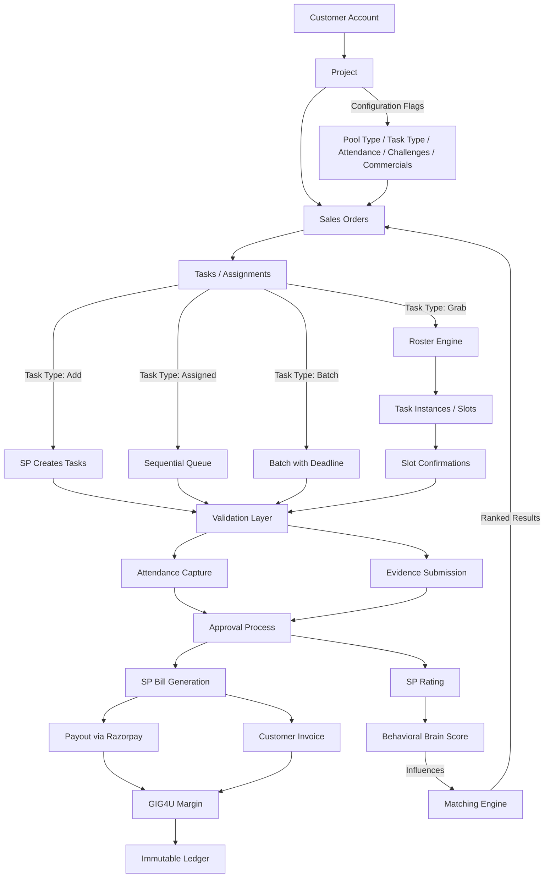
```mermaid
flowchart TD
    CUST[Customer Account] --> PROJ[Project]
    PROJ --> |Configuration Flags| PROJ_CONFIG[Pool Type / Task Type / Attendance / Challenges / Commercials]
    PROJ --> SO[Sales Orders]
    PROJ_CONFIG --> SO

    SO --> TASK[Tasks / Assignments]
    TASK --> |Task Type: Add| TASK_ADD[SP Creates Tasks]
    TASK --> |Task Type: Assigned| TASK_SEQ[Sequential Queue]
    TASK --> |Task Type: Batch| TASK_BATCH[Batch with Deadline]
    TASK --> |Task Type: Grab| ROSTER[Roster Engine]
    ROSTER --> SLOTS[Task Instances / Slots]
    SLOTS --> CONFIRM[Slot Confirmations]

    TASK_ADD & TASK_SEQ & TASK_BATCH & CONFIRM --> VALIDATE[Validation Layer]
    VALIDATE --> ATT[Attendance Capture]
    VALIDATE --> EVIDENCE[Evidence Submission]
    ATT & EVIDENCE --> APPROVAL[Approval Process]

    APPROVAL --> SP_BILL[SP Bill Generation]
    SP_BILL --> PAYOUT[Payout via Razorpay]
    SP_BILL --> CUST_INVOICE[Customer Invoice]
    PAYOUT --> MARGIN[GIG4U Margin]
    CUST_INVOICE --> MARGIN
    MARGIN --> LEDGER[Immutable Ledger]

    APPROVAL --> RATING[SP Rating]
    RATING --> BRAIN[Behavioral Brain Score]
    BRAIN --> |Influences| MATCHING[Matching Engine]
    MATCHING --> |Ranked Results| SO
```

---

## 6. Integration Points

### External Services

| Service | Purpose | Integration Type | Priority |
|---------|---------|-----------------|----------|
| **Razorpay** | SP payouts + customer payments | REST API / SDK | MVP Critical |
| **WhatsApp Business API** | Primary OTP delivery, notifications, job alerts | REST API / Webhooks | MVP Critical |
| **SMS Gateway** | Fallback OTP delivery, critical notifications | REST API | MVP Critical |
| **Google Maps / Places API** | Location services, geocoding, geo-validation, distance calculation | REST API | MVP Critical |
| **AWS S3** | File storage (evidence, documents, certificates, videos) | AWS SDK | MVP Critical |
| **OpenAI / Gemini / OpenRouter** | AI scoring (challenges), attribute extraction, matching refinement | REST API | MVP (basic), Phase 2 (full) |
| **ONDC** | Open network integration — Beckn protocol buyer/seller nodes | REST API (search, select, init, confirm, track) | Phase 4 |

### Internal Service Communication

| From | To | Protocol | Purpose |
|------|-----|----------|---------|
| NestJS API | PostgreSQL | Prisma ORM | All data operations |
| NestJS API | Redis | ioredis | Caching, session, pub/sub |
| NestJS API | BullMQ (Redis) | BullMQ SDK | Background job queuing |
| NestJS API | FastAPI (AI Brain) | Internal HTTP | Scoring, matching, extraction |
| NestJS API | S3 | AWS SDK | File upload/download URLs |
| NestJS API | Razorpay | REST API | Payment operations |
| WebSocket Gateway | Clients | Socket.io | Real-time: chat, timers, slot updates |

---

## 7. Technology Stack

> **Note:** The original PRD specified LAMP (PHP 8.2, MySQL, Flutter). The Tech Stack Proposal v2 recommends a different stack. The v2 proposal below is treated as the latest recommendation. The Solution Architect should confirm the final choice.

### Recommended Stack (Tech Stack Proposal v2)

| Layer | Technology | Justification |
|-------|-----------|---------------|
| **Main API** | NestJS + TypeScript + Prisma | Modular architecture matching GIG4U domains; built-in RBAC guards, audit interceptors, WebSocket support; shared types with frontend |
| **Database** | PostgreSQL (single instance) | ACID transactions for financial data; row-level locking for roster slot grabs; native relational joins for deeply connected entities |
| **Background Jobs** | BullMQ on Redis | Payout batches, expired job cleanup, shift reminders, exception routing, invoice generation; automatic retry on failure |
| **Real-Time** | WebSocket Gateways + Socket.io | Live attendance timer, instant chat, slot availability updates |
| **AI Brain** | FastAPI (Python) | Behavioral scoring, matching/ranking, attribute extraction; Python ML ecosystem (scikit-learn, pandas, numpy) |
| **File Storage** | AWS S3 | Evidence photos/videos, KYC documents, certificates; pre-signed URLs with access control |
| **Cache** | Redis | Session management, frequently accessed data, pub/sub for real-time |
| **Payments** | Razorpay SDK | SP payouts, customer invoicing, payment verification |
| **SP Mobile App** | React Native (Expo) | Single codebase for Android + iOS; same TypeScript as backend; GPS/camera/push natively supported; OTA updates |
| **Web Portal** | Next.js 14 | Customer portal + Admin control plane; SSR for marketplace pages; app router for complex admin UI |

### Original PRD Stack (for reference)

| Layer | Technology |
|-------|-----------|
| Backend | LAMP (Linux, Apache, MySQL 8, PHP 8.2) |
| Mobile App | Flutter Mobile |
| Web Apps | Flutter Web / PWA |

### Key Technology Decisions

| Decision | Reasoning |
|----------|-----------|
| Single PostgreSQL vs split DB | All GIG4U data is deeply relational; roster locking requires row-level guarantees; financial operations need cross-table ACID transactions |
| React Native over Flutter | Same TypeScript language as backend + web; reduces language fragmentation for 60-day timeline with small team |
| Separate AI Brain (FastAPI) | Python ML ecosystem far superior for scoring algorithms; internal HTTP calls make it invisible to end users |
| NestJS over Laravel | TypeScript shared types, native WebSocket/RBAC, larger senior talent pool in India |

---

## 8. Security & RBAC Requirements

### Authentication Flow

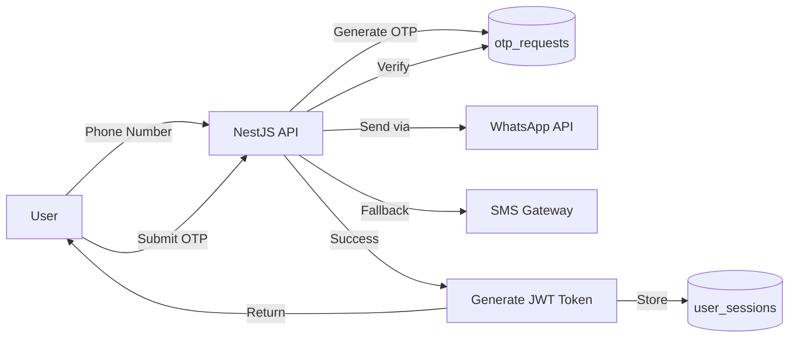
```mermaid
flowchart LR
    USER[User] -->|Phone Number| API[NestJS API]
    API -->|Generate OTP| OTP_DB[(otp_requests)]
    API -->|Send via| WA[WhatsApp API]
    API -->|Fallback| SMS[SMS Gateway]
    USER -->|Submit OTP| API
    API -->|Verify| OTP_DB
    API -->|Success| JWT[Generate JWT Token]
    JWT -->|Store| SESSION[(user_sessions)]
    JWT -->|Return| USER
```

### Role Permission Enforcement Layers

| Layer | Mechanism | Description |
|-------|-----------|-------------|
| **API Layer** | NestJS Guards + Decorators | Every endpoint checks role + tenant before execution |
| **Query Layer** | Prisma Middleware | All queries auto-filtered by `tenant_id`; cross-tenant access blocked |
| **UI Layer** | Component visibility + disabled CTAs | UI shows/hides based on role; disabled actions show reason |

### Sensitive Data Handling

| Data | Storage | Display |
|------|---------|---------|
| PAN number | Encrypted at rest (AES-256) | Masked (show last 4 digits) |
| Aadhaar | Encrypted at rest; consent-based collection | Masked (show last 4 digits) |
| Bank details | Encrypted at rest | Partially masked |
| OTP codes | SHA-256 hashed in DB | Never displayed after entry |
| SP identity (Enterprise sourcing) | Normal storage | Masked during sourcing; revealed post-finalization |

### Enterprise Identity Masking Rules

1. During sourcing phase: customer sees only SP count and fill rate
2. After finalization lock event: `order_finalization_events` created, `final_rosters` snapshot stored
3. Post-finalization: customer can see finalized SP profiles
4. Masking enforced at API query layer — frontend cannot override

---

## 9. Database Schema Considerations

### Core Domains (12)

The schema spans 12 domains with strict separation of concerns:

| Domain | Key Entities | Notes |
|--------|-------------|-------|
| **Auth & Identity** | users, user_sessions, otp_requests, roles, permissions, role_permissions, user_roles | Unified user table; RBAC many-to-many |
| **Tenancy & Customers** | tenants, tenant_users, tenant_locations, tenant_settings, tenant_visibility_policies, tenant_data_retention_policies | tenant_id required on all tenant-owned tables |
| **Service Providers** | service_providers, sp_profiles, sp_status_history, sp_skills, sp_kyc_items, sp_documents, sp_bank_accounts, sp_device_registry | Status history immutable; KYC items independent status |
| **Marketplace** | marketplace_jobs, marketplace_job_locations, marketplace_applications, marketplace_unlock_products, marketplace_unlock_transactions, marketplace_unlock_entitlements | Unlock entitlements are time-bound |
| **Managed/Enterprise** | work_requests, work_quotes, orders, order_locations, order_roster_visibility, order_finalization_events, final_rosters | final_rosters is immutable JSONB snapshot |
| **Execution** | tasks, task_assignments, task_assignment_status_history | Status history tracks all transitions |
| **Attendance** | attendance_sessions, attendance_events, attendance_gps_logs, attendance_exceptions, exception_resolutions, shift_otps | Shift OTP bound to task_assignment_id |
| **Evidence & Forms** | evidence_policies, task_evidence, evidence_files, form_templates, form_template_fields, form_responses, api_activation_callbacks | JSONB for dynamic form responses |
| **Billing & Finance** | bills, bill_items, bill_reviews, bill_disputes, payouts, payout_runs, invoices, invoice_items, invoice_adjustments, payments, ledger_entries | **ledger_entries: NO UPDATES OR DELETES** |
| **Admin Control Plane** | task_types, task_type_versions, attendance_policies, payout_rules, product_bundles, pricing_plans, entitlements, field_components_pool | task_type_versions for change tracking |
| **Notifications** | notification_templates, notification_events, notification_delivery_logs, in_app_notifications | Delivery logs track channel + status |
| **Audit** | audit_logs, activity_logs, error_logs | **audit_logs: IMMUTABLE** |

### Critical Dependency Graph

```
users
  |-- tenants
  |     |-- marketplace_jobs
  |     |     \-- marketplace_applications
  |     |-- orders
  |     |     |-- final_rosters
  |     |     \-- tasks
  |     |          \-- task_assignments
  |     |               |-- attendance_sessions
  |     |               |-- shift_otps
  |     |               |-- task_evidence
  |     |               \-- bills
  |     |                    \-- payouts
  |     \-- invoices
  |          \-- payments
  \-- service_providers
        |-- sp_profiles
        |-- sp_kyc_items
        |-- sp_device_registry
        \-- sp_status_history
```

### Key Schema Rules

1. **All UUIDs as primary keys** — no auto-increment integers
2. **tenant_id on every tenant-owned table** — enforced at query middleware level
3. **Immutability rules:**
   - `ledger_entries`: No UPDATE/DELETE — append-only
   - `audit_logs`: No UPDATE/DELETE — append-only
   - `final_rosters`: Snapshot JSONB — no modifications after creation
   - `sp_status_history`: Append-only transition log
4. **OTP purpose separation:** `otp_requests.purpose` ENUM explicitly separates LOGIN vs SHIFT_START vs SHIFT_END
5. **Dynamic attributes:** JSONB columns on jobs/tasks for role-specific attributes (e.g., cuisine for cook, window type for cleaner)
6. **Soft vs hard delete:** Policy-driven per tenant; audit logs never deleted

---

## 10. API Design Considerations

### RESTful Patterns

| Convention | Standard |
|------------|----------|
| Base path | `/api/v1/` |
| Format | JSON only |
| Auth | Bearer JWT in Authorization header |
| Errors | Standardized error response with code, message, details |
| Pagination | Cursor-based for lists; `limit` + `cursor` parameters |
| Filtering | Query params for common filters |
| Idempotency | Idempotency keys required on all write operations |

### Core API Groups

| Group | Examples |
|-------|---------|
| **Auth** | `POST /auth/otp/send`, `POST /auth/otp/verify`, `POST /auth/refresh` |
| **SP** | `GET /sp/profile`, `PUT /sp/profile`, `POST /sp/kyc`, `GET /sp/jobs`, `POST /sp/apply` |
| **Customer** | `POST /projects`, `GET /projects/:id`, `POST /projects/:id/sales-orders` |
| **Marketplace** | `GET /marketplace/jobs`, `POST /marketplace/jobs/:id/apply`, `POST /marketplace/unlock` |
| **Tasks** | `GET /tasks`, `PUT /tasks/:id/status`, `POST /tasks/:id/evidence` |
| **Attendance** | `POST /attendance/mark-in`, `POST /attendance/mark-out`, `POST /attendance/shift-otp/verify` |
| **Billing** | `GET /bills`, `POST /bills/:id/dispute`, `GET /payouts` |
| **Admin** | `POST /admin/task-types`, `PUT /admin/kyc/:id/verify`, `POST /admin/rosters` |
| **AI** | `GET /ai/match/:job_id`, `GET /ai/sp-score/:sp_id`, `POST /ai/extract-attributes` |

### API Security Rules

1. All endpoints require valid JWT (except auth endpoints)
2. Tenant filtering applied automatically via middleware
3. RBAC checked via NestJS Guards before handler execution
4. Rate limiting: 100 req/min for authenticated, 20 req/min for OTP endpoints
5. Request validation: DTO validation with class-validator
6. Response sanitization: no internal IDs or stack traces in production

### Versioning Strategy

- URL-based versioning: `/api/v1/`, `/api/v2/`
- Breaking changes require new version
- Previous version supported for 6 months minimum

---

## 11. Deployment Architecture Considerations

### Multi-Tenant Architecture

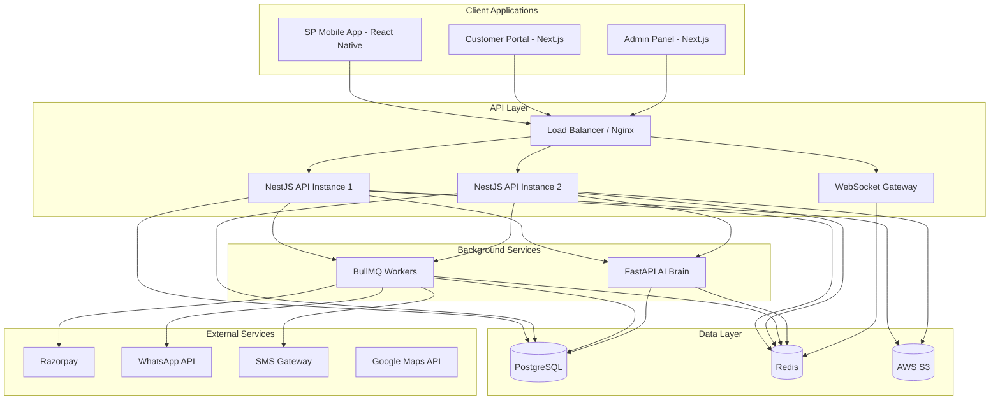
```mermaid
flowchart TD
    subgraph CLIENTS["Client Applications"]
        SP_APP[SP Mobile App - React Native]
        WEB_PORTAL[Customer Portal - Next.js]
        ADMIN_PANEL[Admin Panel - Next.js]
    end

    subgraph API_LAYER["API Layer"]
        LB[Load Balancer / Nginx]
        API1[NestJS API Instance 1]
        API2[NestJS API Instance 2]
        WS[WebSocket Gateway]
    end

    subgraph SERVICES["Background Services"]
        BULL[BullMQ Workers]
        AI[FastAPI AI Brain]
    end

    subgraph DATA["Data Layer"]
        PG[(PostgreSQL)]
        REDIS[(Redis)]
        S3[(AWS S3)]
    end

    subgraph EXTERNAL["External Services"]
        RZP[Razorpay]
        WA_API[WhatsApp API]
        SMS_GW[SMS Gateway]
        MAPS[Google Maps API]
    end

    SP_APP & WEB_PORTAL & ADMIN_PANEL --> LB
    LB --> API1 & API2
    LB --> WS
    API1 & API2 --> PG & REDIS & S3
    API1 & API2 --> AI
    API1 & API2 --> BULL
    BULL --> PG & REDIS
    BULL --> RZP & WA_API & SMS_GW
    AI --> PG & REDIS
    WS --> REDIS
```

### Environment Strategy

| Environment | Purpose | Data |
|-------------|---------|------|
| Development | Local development | Seeded test data |
| Staging | Integration testing, UAT | Anonymized production-like data |
| Pre-Production | Final validation before release | Production mirror |
| Production | Live system | Real data |

### Deployment Rules

1. All environments use identical Docker images (different config only)
2. Database migrations versioned and tested in staging before production
3. Zero-downtime deployments via rolling updates
4. Feature flags for gradual rollout of new capabilities
5. Automated health checks and readiness probes

---

## 12. Scalability Considerations

### Horizontal Scaling Strategy

| Component | Scaling Method |
|-----------|---------------|
| NestJS API | Horizontal — add instances behind load balancer |
| WebSocket Gateway | Horizontal — Redis pub/sub for cross-instance messaging |
| BullMQ Workers | Horizontal — add worker instances; Redis coordinates jobs |
| PostgreSQL | Vertical initially; read replicas for reporting; connection pooling via PgBouncer |
| Redis | Vertical initially; Redis Cluster for high availability |
| FastAPI AI Brain | Horizontal — stateless, add instances as scoring load increases |

### Caching Strategy

| Data | Cache Location | TTL | Invalidation |
|------|---------------|-----|-------------|
| User sessions | Redis | Token expiry | On logout/refresh |
| Job listings | Redis | 5 minutes | On job status change |
| SP profiles (for matching) | Redis | 15 minutes | On profile update |
| Task type configurations | Redis | 1 hour | On admin update |
| Evidence policies | Redis | 1 hour | On admin update |

### Queue Management (BullMQ)

| Queue | Purpose | Retry Policy |
|-------|---------|-------------|
| `payout-queue` | Razorpay payout execution | 3 retries, exponential backoff |
| `notification-queue` | WhatsApp/SMS/push delivery | 3 retries, 30s delay |
| `expiry-queue` | Job/OTP/entitlement expiry checks | 1 retry, immediate |
| `invoice-queue` | Invoice generation post approval | 2 retries, 60s delay |
| `attendance-exception-queue` | Exception routing to approvers | 2 retries, 30s delay |
| `ai-scoring-queue` | Behavioral brain daily aggregation | 1 retry, next scheduled run |

### Database Performance Considerations

1. **Indexes:** Composite indexes on (tenant_id, status), (sp_id, status), (job_id, created_at)
2. **Partitioning:** Consider range partitioning on `audit_logs` and `ledger_entries` by month (grow-only tables)
3. **Connection pooling:** PgBouncer in transaction mode
4. **Read replicas:** Offload reporting/analytics queries from primary
5. **JSONB indexing:** GIN indexes on dynamic attribute JSONB columns for search

---

## 13. AI & Dynamic Attributes

### AI Architecture

The AI layer is an **augmentation layer, not core logic**. Core logic (booking, payments, eligibility, conflict detection, attendance validation) remains deterministic.

**AI is used for:**
- Suggestions and recommendations
- Ranking improvements
- Behavioral predictions
- Natural language understanding (attribute extraction from JDs)
- Analytics and insights

**AI is NOT used for:**
- Booking logic
- Payment processing
- Eligibility checks
- Conflict detection
- Attendance validation

### Matching Engine

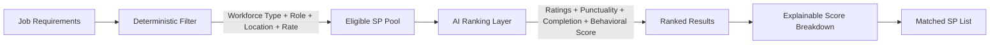
```mermaid
flowchart LR
    INPUT[Job Requirements] --> FILTER[Deterministic Filter]
    FILTER --> |Workforce Type + Role + Location + Rate| ELIGIBLE[Eligible SP Pool]
    ELIGIBLE --> AI_RANK[AI Ranking Layer]
    AI_RANK --> |Ratings + Punctuality + Completion + Behavioral Score| RANKED[Ranked Results]
    RANKED --> EXPLAIN[Explainable Score Breakdown]
    EXPLAIN --> OUTPUT[Matched SP List]
```

**Deterministic filtering first (MVP):**
- Workforce type + role match
- Skills match
- Location proximity (field) or availability (digital)
- Rate compatibility

**AI refinement layer:**
- Ratings and average score
- Task completion ratio
- Attendance punctuality
- Cancellation rate (lower is better)
- Challenge completion/score
- Behavioral brain reliability score

### Dynamic Attributes (JSONB Strategy)

Different job roles need different parameters. Instead of adding columns per role, use PostgreSQL JSONB:

```sql
-- Jobs table has fixed core fields + dynamic JSONB
CREATE TABLE marketplace_jobs (
    id UUID PRIMARY KEY,
    tenant_id UUID NOT NULL,
    title VARCHAR,
    -- ... core fields ...
    dynamic_attributes JSONB DEFAULT '{}'
);

-- Example for a cook role:
-- {"cuisine": ["Indo-Chinese", "North Indian"], "bread_skill": ["naan", "paratha"]}

-- Example for a cleaner role:
-- {"cleaning_type": ["deep_clean"], "window_cleaning": true}
```

**Governance:** `attribute_catalog` table maintains allowed attributes per role:

| Column | Type | Purpose |
|--------|------|---------|
| role | VARCHAR | Job role this attribute applies to |
| attribute_name | VARCHAR | e.g., "cuisine", "bread_skill" |
| data_type | ENUM | STRING, ARRAY, BOOLEAN, NUMBER |
| options | JSONB | Allowed values for validation |

### AI Provider Strategy

| Provider | Use Case | Notes |
|----------|----------|-------|
| OpenAI (GPT-4o) | Production ranking and attribute extraction | ~$5/$15 per 1M tokens (input/output) |
| Gemini 1.5 Pro | Competitive pricing for long-context tasks | Good for JD parsing |
| OpenRouter | Development experimentation | Gateway to multiple models |

---

## 14. Key Architectural Decisions

### Decision 1: Policy-Driven Execution

**Decision:** All task execution mechanics (evidence, attendance, payout, forms) are configured via admin control plane — not hardcoded.

**Rationale:** Different clients need different validation rules. A retail store audit has different evidence needs than an event staffing shift. Making everything configurable via policies eliminates developer intervention for new client onboarding.

### Decision 2: Progressive Gating (No Hard Blocks)

**Decision:** SP browsing is never blocked. Restrictions only apply to specific actions (apply, accept, attend, payout) with clear reason + fix CTA.

**Rationale:** Blocking users from browsing increases drop-off. Progressive gating maintains engagement while ensuring compliance before critical actions.

### Decision 3: Measurement-First Architecture

**Decision:** Every action generates measurable data: time, location, OTP, evidence, approval events.

**Rationale:** GIG4U's moat is measurement. The platform prices certainty, not effort. Without measurement infrastructure, there's no differentiation from basic job boards.

### Decision 4: Enterprise Identity Masking

**Decision:** During sourcing, enterprise customers see only counts and fill rates — never individual SP identities. Reveal happens only after finalization lock.

**Rationale:** Enterprise customers don't want to manage people. They want results. Masking prevents bias, reduces noise, and positions GIG4U as infrastructure (competing with outsourcing firms, not gig apps).

### Decision 5: Single Database (PostgreSQL)

**Decision:** Use only PostgreSQL for all data instead of PostgreSQL + MongoDB split.

**Rationale:** All GIG4U data is deeply relational. Roster slot grabbing needs row-level locking. Financial operations need cross-table ACID transactions. Split databases create distributed transaction complexity that's not worth the trade-off.

### Decision 6: Separate AI Brain Service

**Decision:** AI scoring/matching runs as a separate FastAPI (Python) service, not embedded in the main NestJS API.

**Rationale:** Python's ML ecosystem (scikit-learn, pandas, numpy) is vastly superior. Separation allows independent scaling, different deployment cadence, and language-appropriate tooling. Internal HTTP calls make it invisible to end users.

### Decision 7: Immutable Financial Records

**Decision:** Ledger entries, audit logs, and final rosters are append-only. No updates or deletes permitted.

**Rationale:** Financial integrity and regulatory compliance. Disputes are resolved by creating new correcting entries, not modifying existing ones.

### Decision 8: Four Distinct Task Types

**Decision:** Platform supports exactly four task types (Add, Assigned, Batch, Grab) with type-specific execution mechanics.

**Rationale:** Each type serves a different operational reality. "Last mile" is not a separate type — it's a usage pattern within Assigned/Batch/Grab with specific project flags (field + strict attendance + geo enforcement).

### Decision 9: Roster Engine as Core Infrastructure

**Decision:** The Grab Task type uses a full roster/scheduler engine with slot management, waitlisting, promotion, conflict detection, and cutoff logic.

**Rationale:** Multi-day, multi-site, multi-vacancy scheduling is the highest-complexity use case. Getting this right enables enterprise-grade workforce orchestration.

### Decision 10: Behavioral Brain from Day 1

**Decision:** Capture ~20 telemetry events from launch to power behavioral scoring, even before AI algorithms are fully refined.

**Rationale:** Data collection cannot be retrofitted. Starting from day 1 ensures sufficient signal for meaningful matching and reliability prediction by the time the AI layer matures.

---

## 15. Module Dependency Map

```mermaid
flowchart TD
    AUTH[Auth and Identity] --> TENANT[Tenancy and Customer Mgmt]
    AUTH --> SP_MGMT[SP Management]

    TENANT --> MARKETPLACE[Marketplace Engine]
    TENANT --> MANAGED[Managed/Enterprise Orchestration]
    TENANT --> ADMIN[Admin Control Plane]

    SP_MGMT --> MARKETPLACE
    SP_MGMT --> MANAGED

    ADMIN --> |Configures| TASK_TYPES[Task Types]
    ADMIN --> |Configures| EVIDENCE_POL[Evidence Policies]
    ADMIN --> |Configures| ATT_POL[Attendance Policies]
    ADMIN --> |Configures| PAYOUT_RULES[Payout Rules]
    ADMIN --> |Configures| FORMS[Forms and Fields]
    ADMIN --> |Configures| CHALLENGE_TPL[Challenge Templates]

    MARKETPLACE --> TASK_ENGINE[Task Execution Engine]
    MANAGED --> TASK_ENGINE
    TASK_TYPES --> TASK_ENGINE

    TASK_ENGINE --> ATTENDANCE[Attendance and Compliance]
    ATT_POL --> ATTENDANCE

    TASK_ENGINE --> EVIDENCE[Evidence and Forms]
    EVIDENCE_POL --> EVIDENCE
    FORMS --> EVIDENCE

    ATTENDANCE --> BILLING[Billing and Finance]
    EVIDENCE --> BILLING
    PAYOUT_RULES --> BILLING

    BILLING --> NOTIFICATIONS[Notifications]
    TASK_ENGINE --> NOTIFICATIONS
    ATTENDANCE --> NOTIFICATIONS

    SP_MGMT --> BEHAVIORAL[Behavioral Brain]
    TASK_ENGINE --> BEHAVIORAL
    ATTENDANCE --> BEHAVIORAL
    NOTIFICATIONS --> BEHAVIORAL

    BEHAVIORAL --> MATCHING[Matching Engine]
    SP_MGMT --> MATCHING
    MATCHING --> MARKETPLACE
    MATCHING --> MANAGED

    CHALLENGE_TPL --> CHALLENGE[Challenge Module]
    CHALLENGE --> MATCHING
    CHALLENGE --> SP_MGMT

    AUTH --> AUDIT[Audit and Observability]
    TENANT --> AUDIT
    BILLING --> AUDIT
    TASK_ENGINE --> AUDIT
```

### Module Build Order (Recommended)

| Phase | Modules | Dependencies |
|-------|---------|-------------|
| **Phase 1** | Auth, Tenancy, Admin skeleton, SP Management, Marketplace | Foundation — no dependencies |
| **Phase 2** | Task Execution, Attendance, Evidence, Billing, Notifications | Depends on Phase 1 entities |
| **Phase 3** | Enterprise Orchestration, Identity Masking, Shift OTP, Challenge Module | Depends on Phase 2 execution engine |
| **Phase 4** | AI Brain, Matching Engine, Behavioral Scoring, Partner Portal, Advanced Analytics | Depends on Phase 2+3 data accumulation |

---


---

